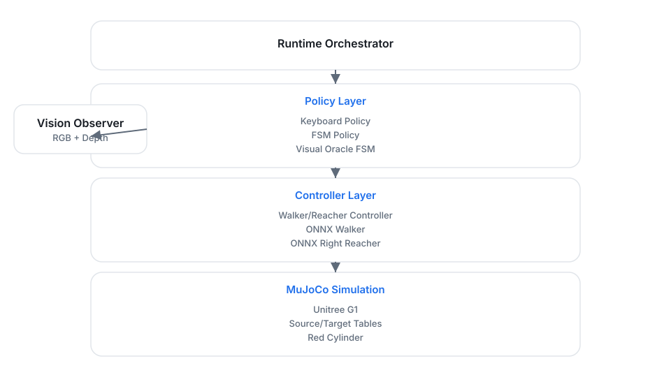

# Repo Snapshot: lucky-robots-g1-pick-place-case-study

## Repo Tree

```text
lucky-robots-g1-pick-place-case-study
├── assets
├── notes
│   └── source-brief.md
├── pages
│   ├── code
│   │   ├── common-controller.html
│   │   ├── common-grasp.html
│   │   ├── common-onnx-policy.html
│   │   ├── common-scene.html
│   │   ├── config-simulation.html
│   │   ├── dev-log.html
│   │   ├── policies-base.html
│   │   ├── policies-fsm-core.html
│   │   ├── policies-fsm.html
│   │   ├── policies-keyboard.html
│   │   ├── run.html
│   │   ├── scripts-smoke-env.html
│   │   └── scripts-test-fsm-approach.html
│   ├── architecture.html
│   ├── challenge.html
│   ├── fsm-baseline.html
│   ├── implementation-deep-dive.html
│   ├── lessons.html
│   ├── limitations-next-steps.html
│   ├── references.html
│   ├── results.html
│   └── visual-oracle.html
├── index.html
├── README.md
├── repo_snapshot.md
├── script.js
└── style.css
```

## File Contents

---

## FILE: `README.md`

```md
# Lucky Robots G1 Pick-and-Place Case Study

## What this repo is
This repository hosts a static, multi-page technical portfolio site about building a modular
pick-and-place baseline for the Unitree G1 humanoid in MuJoCo. It documents the FSM baseline, the
Visual Oracle perception loop, and the engineering tradeoffs that made the autonomous demo
repeatable in simulation.

## How to view locally
- Open `index.html` directly in a browser, or
- Run a simple local server (for example, `python -m http.server`) and visit `http://localhost:8000`.

## Links
- Original implementation repo: TBD
- Demo video: TBD
- Final write-up PDF: Optional / TBD
```

---

## FILE: `index.html`

```html
<!DOCTYPE html>
<html lang="en">
  <head>
    <meta charset="UTF-8" />
    <meta name="viewport" content="width=device-width, initial-scale=1.0" />
    <title>Engineering a Modular Pick-and-Place Baseline for the Unitree G1 Humanoid</title>
    <link rel="stylesheet" href="style.css" />
  </head>
  <body>
    <div class="page">
      <header class="hero" id="top">
        <div class="hero-content">
          <p class="eyebrow">Technical Case Study</p>
          <h1>Engineering a Modular Pick-and-Place Baseline for the Unitree G1 Humanoid</h1>
          <p class="subtitle">
            A portfolio-style case study on turning a manual MuJoCo demo into a modular FSM baseline
            with a Visual Oracle perception loop.
          </p>
          <ul class="badge-list">
            <li>MuJoCo</li>
            <li>Unitree G1</li>
            <li>ONNX Runtime</li>
            <li>Finite-State Machine</li>
            <li>Depth Back-Projection</li>
            <li>Visual Oracle</li>
          </ul>
        </div>
      </header>

      <nav class="top-nav" aria-label="Primary">
        <div class="nav-content">
          <span class="nav-title">Lucky Robots G1</span>
          <div class="nav-links">
            <a href="index.html">Home</a>
            <a href="pages/challenge.html">Challenge</a>
            <a href="pages/architecture.html">Architecture</a>
            <a href="pages/fsm-baseline.html">FSM Baseline</a>
            <a href="pages/visual-oracle.html">Visual Oracle</a>
            <a href="pages/lessons.html">Lessons</a>
            <a href="pages/results.html">Results</a>
            <a href="pages/implementation-deep-dive.html">Implementation</a>
            <a href="pages/limitations-next-steps.html">Limitations</a>
            <a href="pages/references.html">References</a>
          </div>
        </div>
      </nav>

      <main class="content post">
        <section>
          <h2>Project Summary</h2>
          <p>
            This case study documents how the Lucky Robots G1 pick-and-place demo was converted into
            a modular autonomous baseline. The focus is on explicit sequencing with a finite-state
            machine, deterministic grasping logic, and a lightweight Visual Oracle for source
            localization.
          </p>
          <p>
            The end result is intentionally a baseline rather than a production stack. It is designed
            for traceability, targeted debugging, and incremental upgrades.
          </p>
        </section>

        <section>
          <h2>Final architecture at a glance</h2>
          <p>
            The runtime separates orchestration, policy logic, controller synthesis, grasp handling,
            and validation scripts so each layer stays testable in isolation.
          </p>
          <figure class="figure">
            
            <figcaption>
              Runtime orchestration from policy decisions to controller output, with the Vision
              Observer feeding the FSM and Visual Oracle layers.
            </figcaption>
          </figure>
        </section>

        <section>
          <h2>Explore the case study</h2>
          <div class="card-grid">
            <a class="card card-link" href="pages/challenge.html">
              <h3>Challenge</h3>
              <p>Frame the task and why the pick-and-place problem is difficult.</p>
            </a>
            <a class="card card-link" href="pages/architecture.html">
              <h3>Architecture</h3>
              <p>See the system decomposition and runtime layout.</p>
            </a>
            <a class="card card-link" href="pages/fsm-baseline.html">
              <h3>FSM Baseline</h3>
              <p>Walk through the explicit state machine sequencing.</p>
            </a>
            <a class="card card-link" href="pages/visual-oracle.html">
              <h3>Visual Oracle</h3>
              <p>Review the deterministic perception loop for source localization.</p>
            </a>
            <a class="card card-link" href="pages/lessons.html">
              <h3>Lessons</h3>
              <p>Capture the engineering decisions and pitfalls.</p>
            </a>
            <a class="card card-link" href="pages/results.html">
              <h3>Results</h3>
              <p>Summarize the simulation milestones and evidence.</p>
            </a>
            <a class="card card-link" href="pages/implementation-deep-dive.html">
              <h3>Implementation</h3>
              <p>Step through the ground-truth FSM baseline code walkthrough.</p>
            </a>
            <a class="card card-link" href="pages/limitations-next-steps.html">
              <h3>Limitations + Next Steps</h3>
              <p>Review the known gaps and follow-on work.</p>
            </a>
            <a class="card card-link" href="pages/references.html">
              <h3>References</h3>
              <p>Links and supporting resources for the case study.</p>
            </a>
          </div>
        </section>

        <section>
          <h2>What this case study demonstrates</h2>
          <ul class="bullet-list">
            <li>How to decompose a humanoid pick-and-place stack into testable modules.</li>
            <li>Why explicit FSM sequencing is effective for debugging learned policies.</li>
            <li>How deterministic perception can bootstrap a baseline before learned detectors.</li>
            <li>What evidence and logs are needed to defend engineering tradeoffs.</li>
          </ul>
        </section>

        <section>
          <h2>Resources</h2>
          <ul class="bullet-list">
            <li>Original implementation repo: <a href="#">TBD</a></li>
            <li>Demo video: <a href="#">TBD</a></li>
          </ul>
        </section>
      </main>
    </div>
    <script src="script.js"></script>
  </body>
</html>
```

---

## FILE: `notes/source-brief.md`

```md
# Source Brief: Modular Pick-and-Place Baseline Case Study

## Narrative summary
This case study documents how a manual Unitree G1 MuJoCo demo was converted into a modular
pick-and-place baseline. The focus is on clear system decomposition, an explicit FSM sequence, a
lightweight Visual Oracle for source localization, and honest reporting of what the simulation
baseline can and cannot do.

## Core story beats
- **Challenge framing:** move a red cylinder between tables using a humanoid in simulation.
- **Modular stack:** separate perception, locomotion, manipulation, grasping, and sequencing.
- **FSM baseline:** explicit states with timeouts and deterministic transitions for debugging.
- **Visual Oracle:** deterministic depth back-projection with EMA smoothing and frozen estimates.
- **Key lessons:** normalization pitfalls, always-on reacher constraints, accuracy limits, turn-rate
  behavior, and vision freeze strategy.
- **Results + limitations:** milestone table, plot placeholders, and clear caveats about kinematic
  grasping and sim-only validation.

## Tone goals
Professional, technical, and portfolio-ready. Be explicit about tradeoffs, avoid exaggerated
claims, and keep the focus on engineering decisions.
```

---

## FILE: `pages/architecture.html`

```html
<!DOCTYPE html>
<html lang="en">
  <head>
    <meta charset="UTF-8" />
    <meta name="viewport" content="width=device-width, initial-scale=1.0" />
    <title>Architecture | Lucky Robots G1 Pick-and-Place</title>
    <link rel="stylesheet" href="../style.css" />
  </head>
  <body>
    <div class="page">
      <header class="hero hero--subpage">
        <div class="hero-content">
          <p class="eyebrow">Architecture</p>
          <h1>System Decomposition and Runtime Architecture</h1>
          <p class="subtitle">A modular view of the baseline’s runtime, policies, and helpers.</p>
        </div>
      </header>

      <nav class="top-nav" aria-label="Primary">
        <div class="nav-content">
          <span class="nav-title">Lucky Robots G1</span>
          <div class="nav-links">
            <a href="../index.html">Home</a>
            <a href="./challenge.html">Challenge</a>
            <a href="./architecture.html">Architecture</a>
            <a href="./fsm-baseline.html">FSM Baseline</a>
            <a href="./visual-oracle.html">Visual Oracle</a>
            <a href="./lessons.html">Lessons</a>
            <a href="./results.html">Results</a>
            <a href="./implementation-deep-dive.html">Implementation</a>
            <a href="./limitations-next-steps.html">Limitations</a>
            <a href="./references.html">References</a>
          </div>
        </div>
      </nav>

      <main class="content post">
        <section>
          <h2>System Decomposition</h2>
          <p>
            The baseline is decomposed into narrow, testable modules so each subsystem can be tuned
            in isolation while still supporting end-to-end runs. Each module exposes explicit logs
            and thresholds for repeatable debugging.
          </p>
          <div class="card-grid">
            <article class="card">
              <h3>Perception</h3>
              <p>Depth + segmentation back-projection to recover a source-side object pose.</p>
            </article>
            <article class="card">
              <h3>Locomotion</h3>
              <p>ONNX walker policy handles coarse navigation and stance stability.</p>
            </article>
            <article class="card">
              <h3>Manipulation</h3>
              <p>ONNX right reacher overlays arm motion while the walker continues to step.</p>
            </article>
            <article class="card">
              <h3>Grasp</h3>
              <p>Kinematic attachment backend for deterministic pickup and release.</p>
            </article>
            <article class="card">
              <h3>Sequencing</h3>
              <p>Finite-state machine coordinates phases, checks, and timeouts.</p>
            </article>
          </div>
        </section>

        <section>
          <h2>Architecture</h2>
          <p>
            The runtime keeps policy logic separate from control plumbing so each layer can be
            instrumented independently. The core flow is intentionally simple: orchestration,
            policy decisions, control synthesis, and simulation feedback.
          </p>
          <p>
            The main design decision was to separate runtime orchestration, policy decisions,
            controller synthesis, grasp logic, and validation scripts.
          </p>
          <ul class="bullet-list">
            <li><strong>run.py</strong> as the runtime orchestrator and entry point.</li>
            <li><strong>common/controller.py</strong> as the walker/reacher controller layer.</li>
            <li><strong>common/grasp.py</strong> as the kinematic grasp backend.</li>
            <li><strong>policies/fsm_core.py</strong> for the baseline state machine.</li>
            <li><strong>policies/fsm_visual_oracle.py</strong> for the vision-augmented extension.</li>
            <li><strong>vision/geometry.py</strong> and <strong>vision/observer.py</strong> for perception.</li>
          </ul>
          <figure class="figure">
            
            <figcaption>
              Runtime orchestration from policy decisions to controller output, with the Vision
              Observer feeding the FSM and Visual Oracle layers.
            </figcaption>
          </figure>
        </section>
      </main>
    </div>
    <script src="../script.js"></script>
  </body>
</html>
```

---

## FILE: `pages/challenge.html`

```html
<!DOCTYPE html>
<html lang="en">
  <head>
    <meta charset="UTF-8" />
    <meta name="viewport" content="width=device-width, initial-scale=1.0" />
    <title>Challenge | Lucky Robots G1 Pick-and-Place</title>
    <link rel="stylesheet" href="../style.css" />
  </head>
  <body>
    <div class="page">
      <header class="hero hero--subpage">
        <div class="hero-content">
          <p class="eyebrow">Challenge</p>
          <h1>The G1 Pick-and-Place Task</h1>
          <p class="subtitle">Why this autonomous baseline is harder than it first appears.</p>
        </div>
      </header>

      <nav class="top-nav" aria-label="Primary">
        <div class="nav-content">
          <span class="nav-title">Lucky Robots G1</span>
          <div class="nav-links">
            <a href="../index.html">Home</a>
            <a href="./challenge.html">Challenge</a>
            <a href="./architecture.html">Architecture</a>
            <a href="./fsm-baseline.html">FSM Baseline</a>
            <a href="./visual-oracle.html">Visual Oracle</a>
            <a href="./lessons.html">Lessons</a>
            <a href="./results.html">Results</a>
            <a href="./implementation-deep-dive.html">Implementation</a>
            <a href="./limitations-next-steps.html">Limitations</a>
            <a href="./references.html">References</a>
          </div>
        </div>
      </nav>

      <main class="content post">
        <section>
          <p>
            This page frames the task and explains why the problem is harder than simply reaching for
            a cylinder.
          </p>
        </section>

        <section>
          <h2>The Challenge</h2>
          <p>
            The Lucky Robots G1 Pick-and-Place Challenge asked for a red cylinder to be moved from a
            source table to a target table using the Unitree G1 humanoid in MuJoCo. The original
            repository shipped a manual keyboard-controlled demo with walker and reacher ONNX
            policies, a full robot model, a configured scene, and multi-camera visibility. The task
            here was to turn that demo into an autonomous baseline without hiding where the system
            still fails.
          </p>
          <p>
            The result is a modular controller: an explicit finite-state machine, a kinematic grasp
            backend, and a lightweight Visual Oracle for source localization. It is intentionally a
            baseline—not a production-ready stack—but it is structured for debugging and incremental
            upgrades.
          </p>
        </section>

        <section>
          <h2>Why It Is Hard</h2>
          <ul class="bullet-list">
            <li>Humanoid locomotion and manipulation must be coordinated concurrently, not staged.</li>
            <li>The reacher expects pelvis-frame targets, so world-frame goals require careful transforms.</li>
            <li>Learned policies have narrow operating envelopes and drift under small distribution shifts.</li>
            <li>Grasping is contact-rich, and fingertip alignment matters more than global pose accuracy.</li>
            <li>Perception timing interacts with gait, causing jitter or occlusion at the worst moments.</li>
          </ul>
        </section>
      </main>
    </div>
    <script src="../script.js"></script>
  </body>
</html>
```

---

## FILE: `pages/code/common-controller.html`

```html
<!DOCTYPE html>
<html lang="en">
  <head>
    <meta charset="UTF-8" />
    <meta name="viewport" content="width=device-width, initial-scale=1.0" />
    <title>common/controller.py — Walker/Reacher Controller | Lucky Robots G1 Pick-and-Place</title>
    <link rel="stylesheet" href="../../style.css" />
  </head>
  <body>
    <div class="page">
      <header class="hero hero--subpage">
        <div class="hero-content">
          <p class="eyebrow">Implementation</p>
          <h1>common/controller.py — Walker/Reacher Controller</h1>
          <p class="subtitle">The most important low-level module that composes learned walking and reaching.</p>
        </div>
      </header>

      <nav class="top-nav" aria-label="Primary">
        <div class="nav-content">
          <span class="nav-title">Lucky Robots G1</span>
          <div class="nav-links">
            <a href="../../index.html">Home</a>
            <a href="../challenge.html">Challenge</a>
            <a href="../architecture.html">Architecture</a>
            <a href="../fsm-baseline.html">FSM Baseline</a>
            <a href="../visual-oracle.html">Visual Oracle</a>
            <a href="../lessons.html">Lessons</a>
            <a href="../results.html">Results</a>
            <a href="../implementation-deep-dive.html">Implementation</a>
            <a href="../limitations-next-steps.html">Limitations</a>
            <a href="../references.html">References</a>
          </div>
        </div>
      </nav>

      <main class="content">
        <div class="breadcrumb">
          <a href="../implementation-deep-dive.html">Implementation</a> → common/controller.py
        </div>

        <div class="code-subnav">
          <a href="../implementation-deep-dive.html">Back to Implementation Overview</a>
          <div class="next-prev-nav">
            <a href="./run.html">Previous file</a>
            <a href="./common-grasp.html">Next file</a>
          </div>
        </div>

        <div class="code-page-layout">
          <aside class="code-sidebar">
            <div class="code-section">
              <h2>File overview</h2>
              <p><strong>Path:</strong> common/controller.py</p>
              <p>
                Composes walker and right-arm reacher policies, then writes the final joint and finger
                commands into MuJoCo.
              </p>
            </div>
            <div class="code-section">
              <h2>Why it matters</h2>
              <ul class="bullet-list">
                <li>Walker outputs 29 main joint targets.</li>
                <li>Reacher overwrites right-arm columns each tick.</li>
                <li>Finger control stays outside the ONNX policies.</li>
                <li>Raw observations are passed because ONNX normalizes internally.</li>
              </ul>
            </div>
          </aside>

          <div class="code-main">
            <div class="file-tabs">
              <div class="file-tab-buttons">
                <button class="file-tab-button" data-tab-target="constructor">Constructor and state</button>
                <button class="file-tab-button" data-tab-target="mappings">Joint mappings</button>
                <button class="file-tab-button" data-tab-target="walker">Walker observation</button>
                <button class="file-tab-button" data-tab-target="reacher">Reacher overlay</button>
                <button class="file-tab-button" data-tab-target="fingers">Finger actuation</button>
                <button class="file-tab-button" data-tab-target="pd">PD command writing</button>
              </div>

              <div class="file-tab-panel" data-tab-panel="constructor">
                <section class="code-section">
                  <h2>Constructor and state</h2>
                  <p>
                    Controller state is intentionally flat. The runtime constructs the controller once, then
                    each policy tick fills the walk and reach commands before controller.step() runs.
                  </p>
                  <div class="code-block">
                    <pre><code>ctrl = WalkerReacherController(
    model, data, walker, croucher, rotator, config,
    right_reacher=right_reacher,
)</code></pre>
                  </div>
                  <div class="code-block">
                    <pre><code>def _apply_policy_output(ctrl, out) -> None:
  """Write a PolicyOutput into controller state before ctrl.step() runs."""
  ctrl.lin_vel_x, ctrl.lin_vel_y, ctrl.ang_vel_z = out.walk_cmd
  ctrl.reach_target[:] = out.reach_target
  ctrl.reach_active    = out.reach_active
  ctrl.grip_closed     = out.grip_closed</code></pre>
                  </div>
                </section>
              </div>

              <div class="file-tab-panel" data-tab-panel="mappings">
                <section class="code-section">
                  <h2>Joint mappings</h2>
                  <p>
                    Joint order and scaling come from model_config.json so learned outputs line up with
                    MuJoCo actuator indices.
                  </p>
                  <div class="code-block">
                    <pre><code>{
  "joint_names": ["left_hip_pitch_joint", "...", "right_wrist_yaw_joint"],
  "walker": {"input_dim": 99, "output_dim": 29},
  "right_reacher": {"input_dim": 36, "output_dim": 7}
}</code></pre>
                  </div>
                </section>
              </div>

              <div class="file-tab-panel" data-tab-panel="walker">
                <section class="code-section">
                  <h2>Walker observation</h2>
                  <p>
                    The walker receives raw observations because the ONNX model already normalizes its
                    inputs. The controller concatenates velocities, joints, last action, and the current
                    command packet.
                  </p>
                  <div class="code-block">
                    <pre><code>def step(self) -> np.ndarray:
    lin_vel, ang_vel = self._get_base_velocities()
    proj_gravity = self._get_projected_gravity()
    joint_pos = self._get_joint_positions()
    joint_vel = self._get_joint_velocities()

    cmd = np.array(
        [self.lin_vel_x, self.lin_vel_y, self.ang_vel_z],
        dtype=np.float32,
    )

    obs = np.concatenate([
        lin_vel,
        ang_vel,
        proj_gravity,
        joint_pos,
        joint_vel,
        self.last_action,
        cmd,
    ]).astype(np.float32)

    action = self.walker_policy(obs)
    target_pos = self.default_joint_pos + action * self.action_scales</code></pre>
                  </div>
                </section>
              </div>

              <div class="file-tab-panel" data-tab-panel="reacher">
                <section class="code-section">
                  <h2>Reacher overlay</h2>
                  <p>
                    The right-arm reacher runs every tick and overwrites the arm columns so locomotion and
                    manipulation stay in-distribution.
                  </p>
                  <div class="code-block">
                    <pre><code>for idx in self.arm_indices:
    target_pos[idx] = self.default_joint_pos[idx]

if self.right_reacher_policy is not None:
    reacher_obs = np.concatenate([
        self.reach_target,
        self.reach_orientation,
        self._get_palm_pos_in_pelvis(),
        self._get_palm_orientation_in_pelvis(),
        self._get_arm_joint_positions(),
        self._get_arm_joint_velocities(),
        self.last_arm_action,
        proj_gravity.astype(np.float32),
    ]).astype(np.float32)

    arm_action = self.right_reacher_policy(reacher_obs)
    arm_target = self.arm_default_pos + arm_action * self.arm_action_scales</code></pre>
                  </div>
                  <p class="small">
                    The reacher runs unconditionally to keep the arm pose on-policy even when reach_active
                    is false.
                  </p>
                </section>
              </div>

              <div class="file-tab-panel" data-tab-panel="fingers">
                <section class="code-section">
                  <h2>Finger actuation</h2>
                  <p>
                    Finger joints are driven directly from a lookup so the FSM can sequence grip commands
                    without retraining either ONNX policy.
                  </p>
                  <div class="code-block">
                    <pre><code>finger_closed = {
  "right_hand_thumb_0_joint":  0.8,
  "right_hand_thumb_1_joint": -0.9,
  "right_hand_thumb_2_joint": -1.5,
  "right_hand_index_0_joint":  1.4,
  "right_hand_index_1_joint":  1.5,
  "right_hand_middle_0_joint": 1.4,
  "right_hand_middle_1_joint": 1.5,
}</code></pre>
                  </div>
                </section>
              </div>

              <div class="file-tab-panel" data-tab-panel="pd">
                <section class="code-section">
                  <h2>PD command writing</h2>
                  <p>
                    After composing targets, the controller writes 29 joint commands plus finger
                    actuators every tick.
                  </p>
                  <div class="code-block">
                    <pre><code>def apply_pd_control(self, target_pos):
    for i, act_id in enumerate(self.actuator_ids):
        if act_id >= 0:
            self.data.ctrl[act_id] = target_pos[i]

    for act_id, closed_val in self.right_finger_actuators:
        self.data.ctrl[act_id] = closed_val if self.grip_closed else 0.0</code></pre>
                  </div>
                </section>
              </div>
            </div>
          </div>
        </div>
      </main>
    </div>
    <script src="../../script.js"></script>
  </body>
</html>
```

---

## FILE: `pages/code/common-grasp.html`

```html
<!DOCTYPE html>
<html lang="en">
  <head>
    <meta charset="UTF-8" />
    <meta name="viewport" content="width=device-width, initial-scale=1.0" />
    <title>common/grasp.py — Kinematic Grasp Backend | Lucky Robots G1 Pick-and-Place</title>
    <link rel="stylesheet" href="../../style.css" />
  </head>
  <body>
    <div class="page">
      <header class="hero hero--subpage">
        <div class="hero-content">
          <p class="eyebrow">Implementation</p>
          <h1>common/grasp.py — Kinematic Grasp Backend</h1>
          <p class="subtitle">A simulation shortcut that snaps the object to the palm while attached.</p>
        </div>
      </header>

      <nav class="top-nav" aria-label="Primary">
        <div class="nav-content">
          <span class="nav-title">Lucky Robots G1</span>
          <div class="nav-links">
            <a href="../../index.html">Home</a>
            <a href="../challenge.html">Challenge</a>
            <a href="../architecture.html">Architecture</a>
            <a href="../fsm-baseline.html">FSM Baseline</a>
            <a href="../visual-oracle.html">Visual Oracle</a>
            <a href="../lessons.html">Lessons</a>
            <a href="../results.html">Results</a>
            <a href="../implementation-deep-dive.html">Implementation</a>
            <a href="../limitations-next-steps.html">Limitations</a>
            <a href="../references.html">References</a>
          </div>
        </div>
      </nav>

      <main class="content">
        <div class="breadcrumb">
          <a href="../implementation-deep-dive.html">Implementation</a> → common/grasp.py
        </div>

        <div class="code-subnav">
          <a href="../implementation-deep-dive.html">Back to Implementation Overview</a>
          <div class="next-prev-nav">
            <a href="./common-controller.html">Previous file</a>
            <a href="./common-onnx-policy.html">Next file</a>
          </div>
        </div>

        <div class="code-page-layout">
          <aside class="code-sidebar">
            <div class="code-section">
              <h2>File overview</h2>
              <p><strong>Path:</strong> common/grasp.py</p>
              <p>
                A replaceable grasp backend that updates object pose directly when the grip is closed.
              </p>
            </div>
            <div class="code-section">
              <h2>Why it exists</h2>
              <ul class="bullet-list">
                <li>Provides deterministic pickup and release.</li>
                <li>Isolates a simulation-only shortcut behind GraspBackend.</li>
                <li>Disables collisions while attached, restores them on release.</li>
              </ul>
            </div>
          </aside>

          <div class="code-main">
            <div class="file-tabs">
              <div class="file-tab-buttons">
                <button class="file-tab-button" data-tab-target="interface">Interface</button>
                <button class="file-tab-button" data-tab-target="trigger">Attachment trigger</button>
                <button class="file-tab-button" data-tab-target="snap">Snap offset and collision disabling</button>
                <button class="file-tab-button" data-tab-target="pose">Pose update</button>
                <button class="file-tab-button" data-tab-target="release">Release</button>
              </div>

              <div class="file-tab-panel" data-tab-panel="interface">
                <section class="code-section">
                  <h2>Interface</h2>
                  <p>
                    The grasp backend is intentionally small so the kinematic shortcut can be replaced by
                    a contact-based backend later.
                  </p>
                  <div class="code-block">
                    <pre><code>class GraspBackend(ABC):
    @property
    @abstractmethod
    def attached(self) -> bool:
        ...

    @abstractmethod
    def tick(self, grip_closed: bool) -> bool:
        ...

    @abstractmethod
    def release(self) -> None:
        ...</code></pre>
                  </div>
                </section>
              </div>

              <div class="file-tab-panel" data-tab-panel="trigger">
                <section class="code-section">
                  <h2>Attachment trigger</h2>
                  <p>
                    Attachment happens only when the grip is closed and the object is within ATTACH_DIST.
                    Otherwise the backend simply updates or releases when commanded.
                  </p>
                  <div class="code-block">
                    <pre><code>ATTACH_DIST: float = 0.13
SNAP_DIST: float = 0.03

def tick(self, grip_closed: bool) -> bool:
    if not self._is_attached:
        if grip_closed:
            palm = self._data.site_xpos[self._palm_id].copy()
            obj = self._data.xpos[self._obj_id].copy()
            if float(np.linalg.norm(palm - obj)) <= self.ATTACH_DIST:
                self._attach(palm, obj)
    else:
        if not grip_closed:
            self._release()
        else:
            self._update_pose()
    return self._is_attached</code></pre>
                  </div>
                </section>
              </div>

              <div class="file-tab-panel" data-tab-panel="snap">
                <section class="code-section">
                  <h2>Snap offset and collision disabling</h2>
                  <p>
                    The local offset is computed in the palm frame and clamped if it exceeds SNAP_DIST. A
                    valid attachment disables collisions and immediately updates the object pose.
                  </p>
                  <div class="code-block">
                    <pre><code>def _attach(self, palm_pos, obj_pos) -> None:
    palm_rot = self._data.site_xmat[self._palm_id].reshape(3, 3).copy()
    local = palm_rot.T @ (obj_pos - palm_pos)
    d = float(np.linalg.norm(local))
    if d > self.SNAP_DIST:
        local = local * (self.SNAP_DIST / d)
    self._local_offset = local
    self._disable_collisions()
    self._is_attached = True
    self._update_pose()</code></pre>
                  </div>
                </section>
              </div>

              <div class="file-tab-panel" data-tab-panel="pose">
                <section class="code-section">
                  <h2>Pose update</h2>
                  <p>
                    While attached, the backend overwrites the freejoint position and velocity directly.
                  </p>
                  <div class="code-block">
                    <pre><code>def _update_pose(self) -> None:
    palm_pos = self._data.site_xpos[self._palm_id].copy()
    palm_rot = self._data.site_xmat[self._palm_id].reshape(3, 3).copy()
    new_pos = palm_pos + palm_rot @ self._local_offset

    self._data.qpos[self._qposadr:self._qposadr + 3] = new_pos
    self._data.qpos[self._qposadr + 3:self._qposadr + 7] = [1.0, 0.0, 0.0, 0.0]
    self._data.qvel[self._qveladr:self._qveladr + 6] = 0.0</code></pre>
                  </div>
                </section>
              </div>

              <div class="file-tab-panel" data-tab-panel="release">
                <section class="code-section">
                  <h2>Release</h2>
                  <p>
                    Releasing restores collision filters and lets physics take over again.
                  </p>
                  <div class="code-block">
                    <pre><code>def _release(self) -> None:
    self._enable_collisions()
    self._is_attached = False</code></pre>
                  </div>
                  <p class="small">The backend is intentionally replaceable for more realistic grasping.</p>
                </section>
              </div>
            </div>
          </div>
        </div>
      </main>
    </div>
    <script src="../../script.js"></script>
  </body>
</html>
```

---

## FILE: `pages/code/common-onnx-policy.html`

```html
<!DOCTYPE html>
<html lang="en">
  <head>
    <meta charset="UTF-8" />
    <meta name="viewport" content="width=device-width, initial-scale=1.0" />
    <title>common/onnx_policy.py — ONNX Runtime Wrapper | Lucky Robots G1 Pick-and-Place</title>
    <link rel="stylesheet" href="../../style.css" />
  </head>
  <body>
    <div class="page">
      <header class="hero hero--subpage">
        <div class="hero-content">
          <p class="eyebrow">Implementation</p>
          <h1>common/onnx_policy.py — ONNX Runtime Wrapper</h1>
          <p class="subtitle">A minimal CPU wrapper that makes policy inference predictable and portable.</p>
        </div>
      </header>

      <nav class="top-nav" aria-label="Primary">
        <div class="nav-content">
          <span class="nav-title">Lucky Robots G1</span>
          <div class="nav-links">
            <a href="../../index.html">Home</a>
            <a href="../challenge.html">Challenge</a>
            <a href="../architecture.html">Architecture</a>
            <a href="../fsm-baseline.html">FSM Baseline</a>
            <a href="../visual-oracle.html">Visual Oracle</a>
            <a href="../lessons.html">Lessons</a>
            <a href="../results.html">Results</a>
            <a href="../implementation-deep-dive.html">Implementation</a>
            <a href="../limitations-next-steps.html">Limitations</a>
            <a href="../references.html">References</a>
          </div>
        </div>
      </nav>

      <main class="content">
        <div class="breadcrumb">
          <a href="../implementation-deep-dive.html">Implementation</a> → common/onnx_policy.py
        </div>

        <div class="code-subnav">
          <a href="../implementation-deep-dive.html">Back to Implementation Overview</a>
          <div class="next-prev-nav">
            <a href="./common-grasp.html">Previous file</a>
            <a href="./common-scene.html">Next file</a>
          </div>
        </div>

        <div class="code-page-layout">
          <aside class="code-sidebar">
            <div class="code-section">
              <h2>File overview</h2>
              <p><strong>Path:</strong> common/onnx_policy.py</p>
              <p>Wraps ONNX Runtime so policies can be called like simple Python functions.</p>
            </div>
            <div class="code-section">
              <h2>Design goals</h2>
              <ul class="bullet-list">
                <li>CPUExecutionProvider for portability.</li>
                <li>Single-thread inference for stable local runs.</li>
                <li>Simple 1D observation handling.</li>
              </ul>
            </div>
          </aside>

          <div class="code-main">
            <div class="file-tabs">
              <div class="file-tab-buttons">
                <button class="file-tab-button" data-tab-target="session">Session creation</button>
                <button class="file-tab-button" data-tab-target="inference">Inference call</button>
                <button class="file-tab-button" data-tab-target="rationale">Design rationale</button>
              </div>

              <div class="file-tab-panel" data-tab-panel="session">
                <section class="code-section">
                  <h2>Session creation</h2>
                  <p>SessionOptions force predictable CPU inference with a stable thread count.</p>
                  <div class="code-block">
                    <pre><code>class ONNXPolicy:
    def __init__(self, model_path: str | Path):
        sess_options = ort.SessionOptions()
        sess_options.intra_op_num_threads = 1
        sess_options.inter_op_num_threads = 1
        self.session = ort.InferenceSession(
            str(model_path),
            sess_options,
            providers=["CPUExecutionProvider"],
        )
        self.input_name = self.session.get_inputs()[0].name
        self.output_name = self.session.get_outputs()[0].name</code></pre>
                  </div>
                </section>
              </div>

              <div class="file-tab-panel" data-tab-panel="inference">
                <section class="code-section">
                  <h2>Inference call</h2>
                  <p>
                    The call wrapper handles 1D input by reshaping to a batch and returns the first output
                    row for convenience.
                  </p>
                  <div class="code-block">
                    <pre><code>    def __call__(self, obs: np.ndarray) -> np.ndarray:
        if obs.ndim == 1:
            obs = obs.reshape(1, -1)
        obs = obs.astype(np.float32)
        return self.session.run(
            [self.output_name],
            {self.input_name: obs},
        )[0][0]</code></pre>
                  </div>
                </section>
              </div>

              <div class="file-tab-panel" data-tab-panel="rationale">
                <section class="code-section">
                  <h2>Design rationale</h2>
                  <p>
                    Keeping the wrapper small makes smoke tests and controller calls trivial. CPU-only
                    inference plus a fixed thread count improves repeatability across laptops and CI.
                  </p>
                </section>
              </div>
            </div>
          </div>
        </div>
      </main>
    </div>
    <script src="../../script.js"></script>
  </body>
</html>
```

---

## FILE: `pages/code/common-scene.html`

```html
<!DOCTYPE html>
<html lang="en">
  <head>
    <meta charset="UTF-8" />
    <meta name="viewport" content="width=device-width, initial-scale=1.0" />
    <title>common/scene.py — Reset and Rendering Helpers | Lucky Robots G1 Pick-and-Place</title>
    <link rel="stylesheet" href="../../style.css" />
  </head>
  <body>
    <div class="page">
      <header class="hero hero--subpage">
        <div class="hero-content">
          <p class="eyebrow">Implementation</p>
          <h1>common/scene.py — Reset and Rendering Helpers</h1>
          <p class="subtitle">Deterministic reset utilities and offscreen camera rendering.</p>
        </div>
      </header>

      <nav class="top-nav" aria-label="Primary">
        <div class="nav-content">
          <span class="nav-title">Lucky Robots G1</span>
          <div class="nav-links">
            <a href="../../index.html">Home</a>
            <a href="../challenge.html">Challenge</a>
            <a href="../architecture.html">Architecture</a>
            <a href="../fsm-baseline.html">FSM Baseline</a>
            <a href="../visual-oracle.html">Visual Oracle</a>
            <a href="../lessons.html">Lessons</a>
            <a href="../results.html">Results</a>
            <a href="../implementation-deep-dive.html">Implementation</a>
            <a href="../limitations-next-steps.html">Limitations</a>
            <a href="../references.html">References</a>
          </div>
        </div>
      </nav>

      <main class="content">
        <div class="breadcrumb">
          <a href="../implementation-deep-dive.html">Implementation</a> → common/scene.py
        </div>

        <div class="code-subnav">
          <a href="../implementation-deep-dive.html">Back to Implementation Overview</a>
          <div class="next-prev-nav">
            <a href="./common-onnx-policy.html">Previous file</a>
            <a href="./policies-base.html">Next file</a>
          </div>
        </div>

        <div class="code-page-layout">
          <aside class="code-sidebar">
            <div class="code-section">
              <h2>File overview</h2>
              <p><strong>Path:</strong> common/scene.py</p>
              <p>Shared utilities for reset and camera rendering in runtime and tests.</p>
            </div>
            <div class="code-section">
              <h2>Key uses</h2>
              <ul class="bullet-list">
                <li>Offscreen rendering for future perception work.</li>
                <li>Deterministic reset for headless scripts.</li>
              </ul>
            </div>
          </aside>

          <div class="code-main">
            <div class="file-tabs">
              <div class="file-tab-buttons">
                <button class="file-tab-button" data-tab-target="renderer">CameraRenderer</button>
                <button class="file-tab-button" data-tab-target="reset">reset_robot</button>
                <button class="file-tab-button" data-tab-target="determinism">Why deterministic reset matters</button>
              </div>

              <div class="file-tab-panel" data-tab-panel="renderer">
                <section class="code-section">
                  <h2>CameraRenderer</h2>
                  <p>
                    The renderer wraps MuJoCo’s offscreen renderer so scripts can request named cameras
                    without worrying about GPU setup.
                  </p>
                  <div class="code-block">
                    <pre><code>class CameraRenderer:
  def __init__(self, model, data, width: int = 320, height: int = 240):
    self.model = model
    self.data = data
    self.renderer = mujoco.Renderer(model, height, width)

  def render(self, camera_name: str) -> np.ndarray:
    self.renderer.update_scene(self.data, camera=camera_name)
    return self.renderer.render().copy()</code></pre>
                  </div>
                </section>
              </div>

              <div class="file-tab-panel" data-tab-panel="reset">
                <section class="code-section">
                  <h2>reset_robot</h2>
                  <p>
                    Resets the robot to a deterministic base pose and applies default joint angles from
                    model_config.json.
                  </p>
                  <div class="code-block">
                    <pre><code>def reset_robot(
    model,
    data,
    config: dict,
    joint_names: Iterable[str],
    *,
    base_pos=(-0.6, 0.0, 0.76),
    base_quat=(1.0, 0.0, 0.0, 0.0),
    reset_data=True,
) -> None:
    if reset_data:
        mujoco.mj_resetData(model, data)

    data.qpos[0:3] = base_pos
    data.qpos[3:7] = base_quat

    for name, value in config["default_joint_pos"].items():
        idx = joint_index.get(name)
        if idx is not None:
            data.qpos[7 + idx] = value

    mujoco.mj_forward(model, data)</code></pre>
                  </div>
                </section>
              </div>

              <div class="file-tab-panel" data-tab-panel="determinism">
                <section class="code-section">
                  <h2>Why deterministic reset matters</h2>
                  <p>
                    Every runtime loop and headless script assumes the same starting pose, so the reset
                    helper ensures tests and policy debugging stay reproducible across runs.
                  </p>
                </section>
              </div>
            </div>
          </div>
        </div>
      </main>
    </div>
    <script src="../../script.js"></script>
  </body>
</html>
```

---

## FILE: `pages/code/config-simulation.html`

```html
<!DOCTYPE html>
<html lang="en">
  <head>
    <meta charset="UTF-8" />
    <meta name="viewport" content="width=device-width, initial-scale=1.0" />
    <title>Simulation Configuration — g1.xml, scene.xml, model_config.json | Lucky Robots G1 Pick-and-Place</title>
    <link rel="stylesheet" href="../../style.css" />
  </head>
  <body>
    <div class="page">
      <header class="hero hero--subpage">
        <div class="hero-content">
          <p class="eyebrow">Implementation</p>
          <h1>Simulation Configuration — g1.xml, scene.xml, model_config.json</h1>
          <p class="subtitle">The robot, scene, and policy I/O contract that every script relies on.</p>
        </div>
      </header>

      <nav class="top-nav" aria-label="Primary">
        <div class="nav-content">
          <span class="nav-title">Lucky Robots G1</span>
          <div class="nav-links">
            <a href="../../index.html">Home</a>
            <a href="../challenge.html">Challenge</a>
            <a href="../architecture.html">Architecture</a>
            <a href="../fsm-baseline.html">FSM Baseline</a>
            <a href="../visual-oracle.html">Visual Oracle</a>
            <a href="../lessons.html">Lessons</a>
            <a href="../results.html">Results</a>
            <a href="../implementation-deep-dive.html">Implementation</a>
            <a href="../limitations-next-steps.html">Limitations</a>
            <a href="../references.html">References</a>
          </div>
        </div>
      </nav>

      <main class="content">
        <div class="breadcrumb">
          <a href="../implementation-deep-dive.html">Implementation</a> → g1.xml, scene.xml, model_config.json
        </div>

        <div class="code-subnav">
          <a href="../implementation-deep-dive.html">Back to Implementation Overview</a>
          <div class="next-prev-nav">
            <a href="./scripts-test-fsm-approach.html">Previous file</a>
            <a href="./dev-log.html">Next file</a>
          </div>
        </div>

        <div class="code-page-layout">
          <aside class="code-sidebar">
            <div class="code-section">
              <h2>Configuration overview</h2>
              <p>These files lock down physics, camera names, joint order, and policy dimensions.</p>
            </div>
            <div class="code-section">
              <h2>Consistency notes</h2>
              <ul class="bullet-list">
                <li>timestep 0.005 → 200 Hz physics.</li>
                <li>decimation=4 → 50 Hz control.</li>
                <li>right_palm site anchors reaching and grasping.</li>
                <li>model_config joint order must match ONNX outputs.</li>
              </ul>
            </div>
          </aside>

          <div class="code-main">
            <div class="file-tabs">
              <div class="file-tab-buttons">
                <button class="file-tab-button" data-tab-target="g1-physics">g1.xml physics and robot</button>
                <button class="file-tab-button" data-tab-target="g1-cameras">g1.xml cameras/sites</button>
                <button class="file-tab-button" data-tab-target="scene">scene.xml tables/cylinder</button>
                <button class="file-tab-button" data-tab-target="config">model_config.json joint contract</button>
                <button class="file-tab-button" data-tab-target="why">Why config consistency matters</button>
              </div>

              <div class="file-tab-panel" data-tab-panel="g1-physics">
                <section class="code-section">
                  <h2>g1.xml physics and robot</h2>
                  <p>
                    The timestep defines the physics rate, which interacts with the controller decimation.
                  </p>
                  <div class="code-block">
                    <pre><code>&lt;option integrator="implicitfast" timestep="0.005" gravity="0 0 -9.81"/&gt;
&lt;camera name="head_cam" .../&gt;
&lt;site name="right_palm" .../&gt;
&lt;camera name="wrist_cam" .../&gt;</code></pre>
                  </div>
                </section>
              </div>

              <div class="file-tab-panel" data-tab-panel="g1-cameras">
                <section class="code-section">
                  <h2>g1.xml cameras/sites</h2>
                  <p>
                    Named cameras and the right_palm site are required by the smoke tests, controller, and
                    grasp backend.
                  </p>
                </section>
              </div>

              <div class="file-tab-panel" data-tab-panel="scene">
                <section class="code-section">
                  <h2>scene.xml tables/cylinder</h2>
                  <p>
                    scene.xml defines the source and target tables plus the freejoint cylinder object.
                  </p>
                  <div class="code-block">
                    <pre><code>&lt;body name="table" .../&gt;        &lt;!-- source table --&gt;
&lt;body name="table_white" .../&gt; &lt;!-- target table --&gt;
&lt;body name="red_block" ...&gt;
  &lt;freejoint/&gt;
&lt;/body&gt;
&lt;camera name="overhead" .../&gt;</code></pre>
                  </div>
                </section>
              </div>

              <div class="file-tab-panel" data-tab-panel="config">
                <section class="code-section">
                  <h2>model_config.json joint contract</h2>
                  <p>
                    The joint order and policy I/O dimensions must match the ONNX models exactly.
                  </p>
                  <div class="code-block">
                    <pre><code>{
  "joint_names": ["left_hip_pitch_joint", "...", "right_wrist_yaw_joint"],
  "walker": {"input_dim": 99, "output_dim": 29},
  "right_reacher": {"input_dim": 36, "output_dim": 7}
}</code></pre>
                  </div>
                </section>
              </div>

              <div class="file-tab-panel" data-tab-panel="why">
                <section class="code-section">
                  <h2>Why config consistency matters</h2>
                  <p>
                    Any mismatch in joint order, camera names, or timestep breaks downstream logic. Keeping
                    these files aligned is the difference between a runnable baseline and hours of
                    debugging.
                  </p>
                </section>
              </div>
            </div>
          </div>
        </div>
      </main>
    </div>
    <script src="../../script.js"></script>
  </body>
</html>
```

---

## FILE: `pages/code/dev-log.html`

```html
<!DOCTYPE html>
<html lang="en">
  <head>
    <meta charset="UTF-8" />
    <meta name="viewport" content="width=device-width, initial-scale=1.0" />
    <title>DEV_LOG.md — Engineering Evidence | Lucky Robots G1 Pick-and-Place</title>
    <link rel="stylesheet" href="../../style.css" />
  </head>
  <body>
    <div class="page">
      <header class="hero hero--subpage">
        <div class="hero-content">
          <p class="eyebrow">Implementation</p>
          <h1>DEV_LOG.md — Engineering Evidence</h1>
          <p class="subtitle">Short evidence snippets that shaped the baseline design decisions.</p>
        </div>
      </header>

      <nav class="top-nav" aria-label="Primary">
        <div class="nav-content">
          <span class="nav-title">Lucky Robots G1</span>
          <div class="nav-links">
            <a href="../../index.html">Home</a>
            <a href="../challenge.html">Challenge</a>
            <a href="../architecture.html">Architecture</a>
            <a href="../fsm-baseline.html">FSM Baseline</a>
            <a href="../visual-oracle.html">Visual Oracle</a>
            <a href="../lessons.html">Lessons</a>
            <a href="../results.html">Results</a>
            <a href="../implementation-deep-dive.html">Implementation</a>
            <a href="../limitations-next-steps.html">Limitations</a>
            <a href="../references.html">References</a>
          </div>
        </div>
      </nav>

      <main class="content">
        <div class="breadcrumb">
          <a href="../implementation-deep-dive.html">Implementation</a> → DEV_LOG.md
        </div>

        <div class="code-subnav">
          <a href="../implementation-deep-dive.html">Back to Implementation Overview</a>
          <div class="next-prev-nav">
            <a href="./config-simulation.html">Previous file</a>
            <a href="./run.html">Next file</a>
          </div>
        </div>

        <div class="code-page-layout">
          <aside class="code-sidebar">
            <div class="code-section">
              <h2>File overview</h2>
              <p><strong>Path:</strong> DEV_LOG.md</p>
              <p>
                The engineering log captures the reasoning behind thresholds, refactors, and test
                artifacts.
              </p>
            </div>
            <div class="code-section">
              <h2>Evidence themes</h2>
              <ul class="bullet-list">
                <li>Modular refactor checkpoints.</li>
                <li>Smoke test validation records.</li>
                <li>Normalization pitfalls and reacher accuracy limits.</li>
                <li>Kinematic grasp tuning evidence.</li>
              </ul>
            </div>
          </aside>

          <div class="code-main">
            <div class="file-tabs">
              <div class="file-tab-buttons">
                <button class="file-tab-button" data-tab-target="skeleton">Modular skeleton</button>
                <button class="file-tab-button" data-tab-target="smoke">Smoke test evidence</button>
                <button class="file-tab-button" data-tab-target="normalization">Normalization trap</button>
                <button class="file-tab-button" data-tab-target="always">Always-on reacher</button>
                <button class="file-tab-button" data-tab-target="accuracy">Reacher accuracy floor</button>
                <button class="file-tab-button" data-tab-target="grasp">Kinematic grasp evidence</button>
                <button class="file-tab-button" data-tab-target="false">Target-side false positive</button>
              </div>

              <div class="file-tab-panel" data-tab-panel="skeleton">
                <section class="code-section">
                  <h2>Modular skeleton</h2>
                  <p>
                    DEV_LOG captures the extraction of run.py, controller logic, and the FSM into separate
                    modules so each piece could be debugged independently.
                  </p>
                </section>
              </div>

              <div class="file-tab-panel" data-tab-panel="smoke">
                <section class="code-section">
                  <h2>Smoke test evidence</h2>
                  <p>
                    The log records when the environment, cameras, and ONNX policies first passed the
                    headless smoke test, establishing a known-good baseline.
                  </p>
                </section>
              </div>

              <div class="file-tab-panel" data-tab-panel="normalization">
                <section class="code-section">
                  <h2>Normalization trap</h2>
                  <p>
                    The normalization issue proved the ONNX models already normalize internally, so raw
                    observations must be passed to the walker.
                  </p>
                  <div class="code-block">
                    <pre><code>raw zeros        → action max=0.628
normalized zeros → action max=14.78</code></pre>
                  </div>
                </section>
              </div>

              <div class="file-tab-panel" data-tab-panel="always">
                <section class="code-section">
                  <h2>Always-on reacher</h2>
                  <p>
                    DEV_LOG notes that the right reacher must run even when reach_active is false to keep
                    arm joints inside the training distribution.
                  </p>
                </section>
              </div>

              <div class="file-tab-panel" data-tab-panel="accuracy">
                <section class="code-section">
                  <h2>Reacher accuracy floor</h2>
                  <p>
                    The reacher plateaued around 0.12–0.13 m, which shaped hover and descend thresholds
                    near the grasp window.
                  </p>
                </section>
              </div>

              <div class="file-tab-panel" data-tab-panel="grasp">
                <section class="code-section">
                  <h2>Kinematic grasp evidence</h2>
                  <p>
                    The attachment snap distance was tuned to the measured reacher accuracy floor.
                  </p>
                  <div class="code-block">
                    <pre><code>Attach: dist=0.128 m
snap_offset=0.030 m</code></pre>
                  </div>
                </section>
              </div>

              <div class="file-tab-panel" data-tab-panel="false">
                <section class="code-section">
                  <h2>Target-side false positive</h2>
                  <p>
                    Early success checks only used reach windows and produced false positives, so world
                    proximity and yaw gating were added to the target approach.
                  </p>
                </section>
              </div>
            </div>
          </div>
        </div>
      </main>
    </div>
    <script src="../../script.js"></script>
  </body>
</html>
```

---

## FILE: `pages/code/policies-base.html`

```html
<!DOCTYPE html>
<html lang="en">
  <head>
    <meta charset="UTF-8" />
    <meta name="viewport" content="width=device-width, initial-scale=1.0" />
    <title>policies/base.py — Policy Contract | Lucky Robots G1 Pick-and-Place</title>
    <link rel="stylesheet" href="../../style.css" />
  </head>
  <body>
    <div class="page">
      <header class="hero hero--subpage">
        <div class="hero-content">
          <p class="eyebrow">Implementation</p>
          <h1>policies/base.py — Policy Contract</h1>
          <p class="subtitle">Defines the command packet and abstract interface shared by all policies.</p>
        </div>
      </header>

      <nav class="top-nav" aria-label="Primary">
        <div class="nav-content">
          <span class="nav-title">Lucky Robots G1</span>
          <div class="nav-links">
            <a href="../../index.html">Home</a>
            <a href="../challenge.html">Challenge</a>
            <a href="../architecture.html">Architecture</a>
            <a href="../fsm-baseline.html">FSM Baseline</a>
            <a href="../visual-oracle.html">Visual Oracle</a>
            <a href="../lessons.html">Lessons</a>
            <a href="../results.html">Results</a>
            <a href="../implementation-deep-dive.html">Implementation</a>
            <a href="../limitations-next-steps.html">Limitations</a>
            <a href="../references.html">References</a>
          </div>
        </div>
      </nav>

      <main class="content">
        <div class="breadcrumb">
          <a href="../implementation-deep-dive.html">Implementation</a> → policies/base.py
        </div>

        <div class="code-subnav">
          <a href="../implementation-deep-dive.html">Back to Implementation Overview</a>
          <div class="next-prev-nav">
            <a href="./common-scene.html">Previous file</a>
            <a href="./policies-keyboard.html">Next file</a>
          </div>
        </div>

        <div class="code-page-layout">
          <aside class="code-sidebar">
            <div class="code-section">
              <h2>File overview</h2>
              <p><strong>Path:</strong> policies/base.py</p>
              <p>A lightweight contract that keeps policies decoupled from controller internals.</p>
            </div>
            <div class="code-section">
              <h2>Contract principles</h2>
              <ul class="bullet-list">
                <li>Outputs are high-level commands, not actuator targets.</li>
                <li>Frozen dataclass protects policy output immutability.</li>
                <li>Keyboard and FSM policies share the same interface.</li>
              </ul>
            </div>
          </aside>

          <div class="code-main">
            <div class="file-tabs">
              <div class="file-tab-buttons">
                <button class="file-tab-button" data-tab-target="output">PolicyOutput</button>
                <button class="file-tab-button" data-tab-target="base">BasePolicy</button>
                <button class="file-tab-button" data-tab-target="contract">Why this contract matters</button>
              </div>

              <div class="file-tab-panel" data-tab-panel="output">
                <section class="code-section">
                  <h2>PolicyOutput</h2>
                  <p>The command packet keeps walking, reaching, and grip intent explicit.</p>
                  <div class="code-block">
                    <pre><code>WalkCommand = tuple[float, float, float]
ReachTarget = tuple[float, float, float]


@dataclass(frozen=True)
class PolicyOutput:
  """High-level command output from a policy step.

  walk_cmd: (lin_vel_x, lin_vel_y, ang_vel_z)
  reach_target: (x, y, z) target coordinates in pelvis frame
  reach_active: True to run the right-arm reacher ONNX overlay
  grip_closed: True when the right-hand grip should be closed
  """

  walk_cmd: WalkCommand
  reach_target: ReachTarget
  grip_closed: bool
  reach_active: bool = False</code></pre>
                  </div>
                </section>
              </div>

              <div class="file-tab-panel" data-tab-panel="base">
                <section class="code-section">
                  <h2>BasePolicy</h2>
                  <p>
                    BasePolicy keeps runtime code simple and lets policies optionally respond to keyboard
                    input.
                  </p>
                  <div class="code-block">
                    <pre><code>class BasePolicy(ABC):
  """Abstract interface for policies that emit high-level commands."""

  def handle_key(self, keycode: int) -> None:
    """Optional keyboard hook for interactive policies."""
    pass

  @abstractmethod
  def step(self) -> PolicyOutput:
    """Return the latest policy output."""</code></pre>
                  </div>
                </section>
              </div>

              <div class="file-tab-panel" data-tab-panel="contract">
                <section class="code-section">
                  <h2>Why this contract matters</h2>
                  <p>
                    The contract ensures policies never write actuator targets directly. That separation
                    makes it easy to swap KeyboardPolicy and FSMPolicy while keeping a single runtime path.
                  </p>
                </section>
              </div>
            </div>
          </div>
        </div>
      </main>
    </div>
    <script src="../../script.js"></script>
  </body>
</html>
```

---

## FILE: `pages/code/policies-fsm-core.html`

```html
<!DOCTYPE html>
<html lang="en">
  <head>
    <meta charset="UTF-8" />
    <meta name="viewport" content="width=device-width, initial-scale=1.0" />
    <title>policies/fsm_core.py — Autonomous Task Brain | Lucky Robots G1 Pick-and-Place</title>
    <link rel="stylesheet" href="../../style.css" />
  </head>
  <body>
    <div class="page">
      <header class="hero hero--subpage">
        <div class="hero-content">
          <p class="eyebrow">Implementation</p>
          <h1>policies/fsm_core.py — Autonomous Task Brain</h1>
          <p class="subtitle">FSMCore reads MuJoCo state and emits PolicyOutput for every phase.</p>
        </div>
      </header>

      <nav class="top-nav" aria-label="Primary">
        <div class="nav-content">
          <span class="nav-title">Lucky Robots G1</span>
          <div class="nav-links">
            <a href="../../index.html">Home</a>
            <a href="../challenge.html">Challenge</a>
            <a href="../architecture.html">Architecture</a>
            <a href="../fsm-baseline.html">FSM Baseline</a>
            <a href="../visual-oracle.html">Visual Oracle</a>
            <a href="../lessons.html">Lessons</a>
            <a href="../results.html">Results</a>
            <a href="../implementation-deep-dive.html">Implementation</a>
            <a href="../limitations-next-steps.html">Limitations</a>
            <a href="../references.html">References</a>
          </div>
        </div>
      </nav>

      <main class="content">
        <div class="breadcrumb">
          <a href="../implementation-deep-dive.html">Implementation</a> → policies/fsm_core.py
        </div>

        <div class="code-subnav">
          <a href="../implementation-deep-dive.html">Back to Implementation Overview</a>
          <div class="next-prev-nav">
            <a href="./policies-fsm.html">Previous file</a>
            <a href="./scripts-smoke-env.html">Next file</a>
          </div>
        </div>

        <div class="code-page-layout">
          <aside class="code-sidebar">
            <div class="code-section">
              <h2>File overview</h2>
              <p><strong>Path:</strong> policies/fsm_core.py</p>
              <p>
                The autonomous brain that sequences approach, grasp, transport, and placement without
                writing actuator targets directly.
              </p>
            </div>
            <div class="code-section">
              <h2>Design notes</h2>
              <ul class="bullet-list">
                <li>Every phase includes thresholds and timeouts.</li>
                <li>World goals are converted to pelvis-frame reach targets.</li>
                <li>Target-side navigation needed extra validation to avoid false positives.</li>
              </ul>
            </div>
          </aside>

          <div class="code-main">
            <div class="file-tabs">
              <div class="file-tab-buttons">
                <button class="file-tab-button" data-tab-target="state">State enum</button>
                <button class="file-tab-button" data-tab-target="dispatch">Tick dispatch</button>
                <button class="file-tab-button" data-tab-target="source">Source approach</button>
                <button class="file-tab-button" data-tab-target="reach">Reach window and debounce</button>
                <button class="file-tab-button" data-tab-target="hover">Hover/descend geometry</button>
                <button class="file-tab-button" data-tab-target="conversion">World-to-pelvis reach conversion</button>
                <button class="file-tab-button" data-tab-target="grip">Close grip and lift</button>
                <button class="file-tab-button" data-tab-target="drop">Target drop point</button>
                <button class="file-tab-button" data-tab-target="nav">Target navigation phases</button>
                <button class="file-tab-button" data-tab-target="place">Placement and release</button>
                <button class="file-tab-button" data-tab-target="done">Done and validation caveats</button>
              </div>

              <div class="file-tab-panel" data-tab-panel="state">
                <section class="code-section">
                  <h2>State enum</h2>
                  <p>Explicit states make it easy to trace autonomy decisions over time.</p>
                  <div class="code-block">
                    <pre><code>class FSMState(Enum):
    SETTLE = auto()
    APPROACH_SOURCE = auto()
    HOVER_SOURCE = auto()
    DESCEND_SOURCE = auto()
    CLOSE_GRIP = auto()
    LIFT_SOURCE = auto()
    APPROACH_TARGET = auto()
    HOVER_TARGET = auto()
    LOWER_TARGET = auto()
    OPEN_GRIP = auto()
    RETRACT = auto()
    DONE = auto()</code></pre>
                  </div>
                </section>
              </div>

              <div class="file-tab-panel" data-tab-panel="dispatch">
                <section class="code-section">
                  <h2>Tick dispatch</h2>
                  <p>
                    FSMCore reads MuJoCo state each tick and dispatches to a per-state handler that emits a
                    PolicyOutput instead of direct actuator commands.
                  </p>
                  <div class="code-block">
                    <pre><code>def tick(self, attached: bool = False) -> PolicyOutput:
    self._tick_total += 1
    self._tick_state += 1
    self._attached = attached

    if self.state == FSMState.SETTLE:
        return self._settle()
    if self.state == FSMState.APPROACH_SOURCE:
        return self._approach_source()
    if self.state == FSMState.HOVER_SOURCE:
        return self._hover_source()
    ...</code></pre>
                  </div>
                </section>
              </div>

              <div class="file-tab-panel" data-tab-panel="source">
                <section class="code-section">
                  <h2>Source approach</h2>
                  <p>
                    The source approach uses a staircase velocity schedule to keep forward speed high
                    while still settling near the reach window.
                  </p>
                  <div class="code-block">
                    <pre><code>x_err = cyl[0] - APPROACH_TARGET_X

if x_err > 0.18:
    vx = VX_FAST
elif x_err > 0.10:
    vx = VX_MED
elif x_err > 0.04:
    vx = VX_SLOW
else:
    vx = 0.0

y_err = cyl[1] - (-0.05)
vy = float(np.clip(K_VY * y_err, -VY_CAP, VY_CAP))

heading = np.arctan2(cyl[1], max(cyl[0], 0.15))
wz = float(np.clip(K_WZ * heading, -WZ_CAP, WZ_CAP))</code></pre>
                  </div>
                </section>
              </div>

              <div class="file-tab-panel" data-tab-panel="reach">
                <section class="code-section">
                  <h2>Reach window and debounce</h2>
                  <p>
                    Reach windows are guarded with debounce counters so transient alignment does not
                    trigger premature transitions.
                  </p>
                  <div class="code-block">
                    <pre><code>TARGET_NEAR_EDGE_INSET = 0.05
TARGET_REACH_DEBOUNCE = 8
TARGET_APPROACH_TIMEOUT = 900</code></pre>
                  </div>
                </section>
              </div>

              <div class="file-tab-panel" data-tab-panel="hover">
                <section class="code-section">
                  <h2>Hover/descend geometry</h2>
                  <p>
                    Source-side hover and descend targets are defined in world space relative to the table
                    surface, then handed to the reach converter.
                  </p>
                  <div class="code-block">
                    <pre><code>def _palm_world(self):
    return self._data.site_xpos[self._palm_id].copy()

def _table_surface_z(self):
    return (
        self._data.geom_xpos[self._tbl_geom_id][2]
        + self._model.geom_size[self._tbl_geom_id][2]
    )

def _source_hover_world(self):
    cyl = self._cylinder_world()
    return np.array([cyl[0], cyl[1], self._table_surface_z() + 0.18])

def _source_grasp_world(self):
    cyl = self._cylinder_world()
    return np.array([cyl[0], cyl[1], self._table_surface_z() + 0.06])</code></pre>
                  </div>
                </section>
              </div>

              <div class="file-tab-panel" data-tab-panel="conversion">
                <section class="code-section">
                  <h2>World-to-pelvis reach conversion</h2>
                  <p>
                    World-frame targets are translated into the pelvis frame with a right-arm bias so
                    commands stay in the reachable workspace.
                  </p>
                  <div class="code-block">
                    <pre><code>def _reach_from_world(self, world_point, right_bias=-0.08):
    pos, quat = self._pelvis_pose()
    local = self._world_to_pelvis(pos, quat, world_point).copy()
    local[1] = min(local[1], right_bias)
    return self._clip_reach_target(local)</code></pre>
                  </div>
                </section>
              </div>

              <div class="file-tab-panel" data-tab-panel="grip">
                <section class="code-section">
                  <h2>Close grip and lift</h2>
                  <p>
                    CLOSE_GRIP waits for attachment while LIFT_SOURCE returns the arm to a carry pose.
                    These phases rely on attachment state rather than pure distance checks.
                  </p>
                  <div class="code-block">
                    <pre><code>CLOSE_GRIP = auto()
LIFT_SOURCE = auto()</code></pre>
                  </div>
                </section>
              </div>

              <div class="file-tab-panel" data-tab-panel="drop">
                <section class="code-section">
                  <h2>Target drop point</h2>
                  <p>
                    Placement height is anchored to the target table surface, mirroring the source-side
                    hover/descend geometry.
                  </p>
                  <div class="code-block">
                    <pre><code>def _table_surface_z(self):
    return (
        self._data.geom_xpos[self._tbl_geom_id][2]
        + self._model.geom_size[self._tbl_geom_id][2]
    )</code></pre>
                  </div>
                </section>
              </div>

              <div class="file-tab-panel" data-tab-panel="nav">
                <section class="code-section">
                  <h2>Target navigation phases</h2>
                  <p>
                    Target-side navigation uses stand distance, yaw checks, and phased velocities because
                    a simple reach window produced false positives.
                  </p>
                  <div class="code-block">
                    <pre><code>VX_P1 = 0.12
WZ_P1 = 1.0
PHASE1_ALIGN_TOL = 0.40
TARGET_STAND_DIST = 0.24
TARGET_APPROACH_DIST_THRESH = 0.08</code></pre>
                  </div>
                </section>
              </div>

              <div class="file-tab-panel" data-tab-panel="place">
                <section class="code-section">
                  <h2>Placement and release</h2>
                  <p>
                    The placement sequence hovers, lowers, opens the grip, retracts, and then marks the
                    run as DONE once the object is released.
                  </p>
                  <div class="code-block">
                    <pre><code>HOVER_TARGET
LOWER_TARGET
OPEN_GRIP
RETRACT
DONE</code></pre>
                  </div>
                </section>
              </div>

              <div class="file-tab-panel" data-tab-panel="done">
                <section class="code-section">
                  <h2>Done and validation caveats</h2>
                  <p>
                    DONE is not enough on its own: target-side validation needed proximity and yaw checks,
                    plus post-settle on-table confirmation to avoid false positives.
                  </p>
                </section>
              </div>
            </div>
          </div>
        </div>
      </main>
    </div>
    <script src="../../script.js"></script>
  </body>
</html>
```

---

## FILE: `pages/code/policies-fsm.html`

```html
<!DOCTYPE html>
<html lang="en">
  <head>
    <meta charset="UTF-8" />
    <meta name="viewport" content="width=device-width, initial-scale=1.0" />
    <title>policies/fsm.py — FSM Adapter and Grip Safety | Lucky Robots G1 Pick-and-Place</title>
    <link rel="stylesheet" href="../../style.css" />
  </head>
  <body>
    <div class="page">
      <header class="hero hero--subpage">
        <div class="hero-content">
          <p class="eyebrow">Implementation</p>
          <h1>policies/fsm.py — FSM Adapter and Grip Safety</h1>
          <p class="subtitle">Bridges FSMCore outputs into controller state and guards grip commands.</p>
        </div>
      </header>

      <nav class="top-nav" aria-label="Primary">
        <div class="nav-content">
          <span class="nav-title">Lucky Robots G1</span>
          <div class="nav-links">
            <a href="../../index.html">Home</a>
            <a href="../challenge.html">Challenge</a>
            <a href="../architecture.html">Architecture</a>
            <a href="../fsm-baseline.html">FSM Baseline</a>
            <a href="../visual-oracle.html">Visual Oracle</a>
            <a href="../lessons.html">Lessons</a>
            <a href="../results.html">Results</a>
            <a href="../implementation-deep-dive.html">Implementation</a>
            <a href="../limitations-next-steps.html">Limitations</a>
            <a href="../references.html">References</a>
          </div>
        </div>
      </nav>

      <main class="content">
        <div class="breadcrumb">
          <a href="../implementation-deep-dive.html">Implementation</a> → policies/fsm.py
        </div>

        <div class="code-subnav">
          <a href="../implementation-deep-dive.html">Back to Implementation Overview</a>
          <div class="next-prev-nav">
            <a href="./policies-keyboard.html">Previous file</a>
            <a href="./policies-fsm-core.html">Next file</a>
          </div>
        </div>

        <div class="code-page-layout">
          <aside class="code-sidebar">
            <div class="code-section">
              <h2>File overview</h2>
              <p><strong>Path:</strong> policies/fsm.py</p>
              <p>Adapts FSMCore outputs into controller state and integrates grasp backend state.</p>
            </div>
            <div class="code-section">
              <h2>Key responsibilities</h2>
              <ul class="bullet-list">
                <li>Pass attachment state into FSMCore.</li>
                <li>Write walk and reach targets into the controller.</li>
                <li>Guard grip commands to prevent accidental drops.</li>
              </ul>
            </div>
          </aside>

          <div class="code-main">
            <div class="file-tabs">
              <div class="file-tab-buttons">
                <button class="file-tab-button" data-tab-target="construction">FSMPolicy construction</button>
                <button class="file-tab-button" data-tab-target="adapter">step adapter</button>
                <button class="file-tab-button" data-tab-target="guard">close grip guard</button>
                <button class="file-tab-button" data-tab-target="release">release-state exemption</button>
              </div>

              <div class="file-tab-panel" data-tab-panel="construction">
                <section class="code-section">
                  <h2>FSMPolicy construction</h2>
                  <p>
                    FSMPolicy keeps a reference to the controller, the grasp backend, and a dedicated
                    FSMCore instance.
                  </p>
                  <div class="code-block">
                    <pre><code>class FSMPolicy(BasePolicy):
    def __init__(self, controller, grasp_backend=None):
        self._controller = controller
        self._grasp_backend = grasp_backend
        self._fsm = FSMCore(controller.model, controller.data)</code></pre>
                  </div>
                </section>
              </div>

              <div class="file-tab-panel" data-tab-panel="adapter">
                <section class="code-section">
                  <h2>step adapter</h2>
                  <p>
                    The adapter reads the current attachment state, ticks the FSM, and writes high-level
                    commands into controller fields.
                  </p>
                  <div class="code-block">
                    <pre><code>    def step(self) -> PolicyOutput:
        attached = (
            self._grasp_backend.attached
            if self._grasp_backend is not None
            else False
        )

        out = self._fsm.tick(attached=attached)

        self._controller.lin_vel_x, self._controller.lin_vel_y, self._controller.ang_vel_z = out.walk_cmd
        self._controller.reach_target[:] = out.reach_target
        self._controller.reach_active = out.reach_active
        self._controller.grip_closed = self._close_grip_command(out)

        return out</code></pre>
                  </div>
                </section>
              </div>

              <div class="file-tab-panel" data-tab-panel="guard">
                <section class="code-section">
                  <h2>close grip guard</h2>
                  <p>
                    The guard keeps the grip closed while attached so accidental drop commands do not
                    release the object mid-transport.
                  </p>
                  <div class="code-block">
                    <pre><code>def _close_grip_command(self, out: PolicyOutput) -> bool:
    if self._grasp_backend is None:
        return out.grip_closed

    if self._fsm.state in _RELEASE_STATES:
        return out.grip_closed

    if self._grasp_backend.attached:
        return True

    return out.grip_closed</code></pre>
                  </div>
                </section>
              </div>

              <div class="file-tab-panel" data-tab-panel="release">
                <section class="code-section">
                  <h2>release-state exemption</h2>
                  <p>
                    Release states are explicitly exempt from the guard so the FSM can open the grip when
                    it reaches the target table.
                  </p>
                  <div class="code-block">
                    <pre><code>_RELEASE_STATES = frozenset({
    FSMState.OPEN_GRIP,
    FSMState.RETRACT,
    FSMState.DONE,
})</code></pre>
                  </div>
                </section>
              </div>
            </div>
          </div>
        </div>
      </main>
    </div>
    <script src="../../script.js"></script>
  </body>
</html>
```

---

## FILE: `pages/code/policies-keyboard.html`

```html
<!DOCTYPE html>
<html lang="en">
  <head>
    <meta charset="UTF-8" />
    <meta name="viewport" content="width=device-width, initial-scale=1.0" />
    <title>policies/keyboard.py — Manual Regression Policy | Lucky Robots G1 Pick-and-Place</title>
    <link rel="stylesheet" href="../../style.css" />
  </head>
  <body>
    <div class="page">
      <header class="hero hero--subpage">
        <div class="hero-content">
          <p class="eyebrow">Implementation</p>
          <h1>policies/keyboard.py — Manual Regression Policy</h1>
          <p class="subtitle">Preserves the manual control path as a first-class policy.</p>
        </div>
      </header>

      <nav class="top-nav" aria-label="Primary">
        <div class="nav-content">
          <span class="nav-title">Lucky Robots G1</span>
          <div class="nav-links">
            <a href="../../index.html">Home</a>
            <a href="../challenge.html">Challenge</a>
            <a href="../architecture.html">Architecture</a>
            <a href="../fsm-baseline.html">FSM Baseline</a>
            <a href="../visual-oracle.html">Visual Oracle</a>
            <a href="../lessons.html">Lessons</a>
            <a href="../results.html">Results</a>
            <a href="../implementation-deep-dive.html">Implementation</a>
            <a href="../limitations-next-steps.html">Limitations</a>
            <a href="../references.html">References</a>
          </div>
        </div>
      </nav>

      <main class="content">
        <div class="breadcrumb">
          <a href="../implementation-deep-dive.html">Implementation</a> → policies/keyboard.py
        </div>

        <div class="code-subnav">
          <a href="../implementation-deep-dive.html">Back to Implementation Overview</a>
          <div class="next-prev-nav">
            <a href="./policies-base.html">Previous file</a>
            <a href="./policies-fsm.html">Next file</a>
          </div>
        </div>

        <div class="code-page-layout">
          <aside class="code-sidebar">
            <div class="code-section">
              <h2>File overview</h2>
              <p><strong>Path:</strong> policies/keyboard.py</p>
              <p>Maintains the original manual control path inside the unified policy interface.</p>
            </div>
            <div class="code-section">
              <h2>Why it stayed</h2>
              <ul class="bullet-list">
                <li>Preserves the original keyboard behavior.</li>
                <li>Provides a regression baseline for the refactor.</li>
                <li>Uses the same runtime path as the FSM policy.</li>
              </ul>
            </div>
          </aside>

          <div class="code-main">
            <div class="file-tabs">
              <div class="file-tab-buttons">
                <button class="file-tab-button" data-tab-target="handle">handle_key</button>
                <button class="file-tab-button" data-tab-target="step">step output</button>
                <button class="file-tab-button" data-tab-target="why">Why manual control stayed</button>
              </div>

              <div class="file-tab-panel" data-tab-panel="handle">
                <section class="code-section">
                  <h2>handle_key</h2>
                  <p>Keyboard input is forwarded directly to the controller.</p>
                  <div class="code-block">
                    <pre><code>class KeyboardPolicy(BasePolicy):
    def __init__(self, controller):
        self.controller = controller

    def handle_key(self, key: int) -> None:
        self.controller.key_callback(key)</code></pre>
                  </div>
                </section>
              </div>

              <div class="file-tab-panel" data-tab-panel="step">
                <section class="code-section">
                  <h2>step output</h2>
                  <p>
                    The policy mirrors controller state into a PolicyOutput so the runtime loop stays
                    identical across policies.
                  </p>
                  <div class="code-block">
                    <pre><code>    def step(self) -> PolicyOutput:
        return PolicyOutput(
            walk_cmd=(
                self.controller.lin_vel_x,
                self.controller.lin_vel_y,
                self.controller.ang_vel_z,
            ),
            reach_target=tuple(self.controller.reach_target),
            reach_active=self.controller.reach_active,
            grip_closed=self.controller.grip_closed,
        )</code></pre>
                  </div>
                </section>
              </div>

              <div class="file-tab-panel" data-tab-panel="why">
                <section class="code-section">
                  <h2>Why manual control stayed</h2>
                  <p>
                    Manual control is a regression path: it validates controller changes without relying
                    on the FSM and keeps debugging interactive when automation fails.
                  </p>
                </section>
              </div>
            </div>
          </div>
        </div>
      </main>
    </div>
    <script src="../../script.js"></script>
  </body>
</html>
```

---

## FILE: `pages/code/run.html`

```html
<!DOCTYPE html>
<html lang="en">
  <head>
    <meta charset="UTF-8" />
    <meta name="viewport" content="width=device-width, initial-scale=1.0" />
    <title>run.py — Runtime Orchestration | Lucky Robots G1 Pick-and-Place</title>
    <link rel="stylesheet" href="../../style.css" />
  </head>
  <body>
    <div class="page">
      <header class="hero hero--subpage">
        <div class="hero-content">
          <p class="eyebrow">Implementation</p>
          <h1>run.py — Runtime Orchestration</h1>
          <p class="subtitle">The thin entry point that wires models, policies, control, and simulation.</p>
        </div>
      </header>

      <nav class="top-nav" aria-label="Primary">
        <div class="nav-content">
          <span class="nav-title">Lucky Robots G1</span>
          <div class="nav-links">
            <a href="../../index.html">Home</a>
            <a href="../challenge.html">Challenge</a>
            <a href="../architecture.html">Architecture</a>
            <a href="../fsm-baseline.html">FSM Baseline</a>
            <a href="../visual-oracle.html">Visual Oracle</a>
            <a href="../lessons.html">Lessons</a>
            <a href="../results.html">Results</a>
            <a href="../implementation-deep-dive.html">Implementation</a>
            <a href="../limitations-next-steps.html">Limitations</a>
            <a href="../references.html">References</a>
          </div>
        </div>
      </nav>

      <main class="content">
        <div class="breadcrumb">
          <a href="../implementation-deep-dive.html">Implementation</a> → run.py
        </div>

        <div class="code-subnav">
          <a href="../implementation-deep-dive.html">Back to Implementation Overview</a>
          <div class="next-prev-nav">
            <a href="./dev-log.html">Previous file</a>
            <a href="./common-controller.html">Next file</a>
          </div>
        </div>

        <div class="code-page-layout">
          <aside class="code-sidebar">
            <div class="code-section">
              <h2>File overview</h2>
              <p><strong>Path:</strong> run.py</p>
              <p>
                The runtime shell that loads assets, selects a policy, and keeps the control loop moving.
              </p>
            </div>
            <div class="code-section">
              <h2>Key responsibilities</h2>
              <ul class="bullet-list">
                <li>Load model, config, and ONNX policies.</li>
                <li>Select KeyboardPolicy or FSMPolicy.</li>
                <li>Bridge PolicyOutput into controller state.</li>
                <li>Advance MuJoCo and the grasp backend.</li>
              </ul>
            </div>
          </aside>

          <div class="code-main">
            <div class="file-tabs">
              <div class="file-tab-buttons">
                <button class="file-tab-button" data-tab-target="imports">Imports and refactor boundary</button>
                <button class="file-tab-button" data-tab-target="bridge">Policy output bridge</button>
                <button class="file-tab-button" data-tab-target="wiring">Controller/policy/grasp wiring</button>
                <button class="file-tab-button" data-tab-target="loop">Simulation loop</button>
              </div>

              <div class="file-tab-panel" data-tab-panel="imports">
                <section class="code-section">
                  <h2>Imports and refactor boundary</h2>
                  <p>
                    run.py is intentionally thin. Its imports show what moved out into common helpers and
                    policy modules so the entry point remains a small orchestration layer.
                  </p>
                  <div class="code-block">
                    <pre><code>import argparse
import json
import time
from pathlib import Path

import mujoco
import numpy as np

from common.controller import WalkerReacherController
from common.grasp import KinematicAttachment
from common.onnx_policy import ONNXPolicy
from common.scene import CameraRenderer, reset_robot
from policies.fsm import FSMPolicy
from policies.keyboard import KeyboardPolicy

SCRIPT_DIR = Path(__file__).resolve().parent</code></pre>
                  </div>
                  <p class="small">
                    Viewer setup, camera UI, and timing helpers live here too, but are intentionally kept
                    out of the code snippets.
                  </p>
                </section>
              </div>

              <div class="file-tab-panel" data-tab-panel="bridge">
                <section class="code-section">
                  <h2>Policy output bridge</h2>
                  <p>
                    The bridge keeps PolicyOutput immutable and feeds the controller with a small command
                    packet. This keeps run.py from reaching into FSM internals.
                  </p>
                  <div class="code-block">
                    <pre><code>def _apply_policy_output(ctrl, out) -> None:
  """Write a PolicyOutput into controller state before ctrl.step() runs."""
  ctrl.lin_vel_x, ctrl.lin_vel_y, ctrl.ang_vel_z = out.walk_cmd
  ctrl.reach_target[:] = out.reach_target
  ctrl.reach_active    = out.reach_active
  ctrl.grip_closed     = out.grip_closed</code></pre>
                  </div>
                </section>
              </div>

              <div class="file-tab-panel" data-tab-panel="wiring">
                <section class="code-section">
                  <h2>Controller/policy/grasp wiring</h2>
                  <p>
                    The runtime loads ONNX policies, builds the controller, and chooses between manual
                    and autonomous policies. KinematicAttachment is only constructed for the FSM path.
                  </p>
                  <div class="code-block">
                    <pre><code>ctrl = WalkerReacherController(
    model, data, walker, croucher, rotator, config,
    right_reacher=right_reacher,
)

grasp_backend = None
if args.policy == "fsm":
    rb_body_id = mujoco.mj_name2id(
        model, mujoco.mjtObj.mjOBJ_BODY, "red_block"
    )
    grasp_backend = KinematicAttachment(
        model, data, ctrl.right_palm_site_id, rb_body_id
    )
    policy = FSMPolicy(ctrl, grasp_backend=grasp_backend)
else:
    policy = KeyboardPolicy(ctrl)</code></pre>
                  </div>
                </section>
              </div>

              <div class="file-tab-panel" data-tab-panel="loop">
                <section class="code-section">
                  <h2>Simulation loop</h2>
                  <p>
                    The loop is always policy → controller → PD control → MuJoCo step → grasp tick. Viewer
                    timing and camera updates are present but not shown here to keep the focus on the core
                    runtime sequence.
                  </p>
                  <div class="code-block">
                    <pre><code>out = policy.step()
_apply_policy_output(ctrl, out)

target_pos = ctrl.step()
ctrl.apply_pd_control(target_pos)

mujoco.mj_step(model, data)

if grasp_backend is not None:
    grasp_backend.tick(ctrl.grip_closed)</code></pre>
                  </div>
                </section>
              </div>
            </div>
          </div>
        </div>
      </main>
    </div>
    <script src="../../script.js"></script>
  </body>
</html>
```

---

## FILE: `pages/code/scripts-smoke-env.html`

```html
<!DOCTYPE html>
<html lang="en">
  <head>
    <meta charset="UTF-8" />
    <meta name="viewport" content="width=device-width, initial-scale=1.0" />
    <title>scripts/smoke_env.py — Headless Environment Smoke Test | Lucky Robots G1 Pick-and-Place</title>
    <link rel="stylesheet" href="../../style.css" />
  </head>
  <body>
    <div class="page">
      <header class="hero hero--subpage">
        <div class="hero-content">
          <p class="eyebrow">Implementation</p>
          <h1>scripts/smoke_env.py — Headless Environment Smoke Test</h1>
          <p class="subtitle">Validates the scene, cameras, bodies, and ONNX models before debugging the FSM.</p>
        </div>
      </header>

      <nav class="top-nav" aria-label="Primary">
        <div class="nav-content">
          <span class="nav-title">Lucky Robots G1</span>
          <div class="nav-links">
            <a href="../../index.html">Home</a>
            <a href="../challenge.html">Challenge</a>
            <a href="../architecture.html">Architecture</a>
            <a href="../fsm-baseline.html">FSM Baseline</a>
            <a href="../visual-oracle.html">Visual Oracle</a>
            <a href="../lessons.html">Lessons</a>
            <a href="../results.html">Results</a>
            <a href="../implementation-deep-dive.html">Implementation</a>
            <a href="../limitations-next-steps.html">Limitations</a>
            <a href="../references.html">References</a>
          </div>
        </div>
      </nav>

      <main class="content">
        <div class="breadcrumb">
          <a href="../implementation-deep-dive.html">Implementation</a> → scripts/smoke_env.py
        </div>

        <div class="code-subnav">
          <a href="../implementation-deep-dive.html">Back to Implementation Overview</a>
          <div class="next-prev-nav">
            <a href="./policies-fsm-core.html">Previous file</a>
            <a href="./scripts-test-fsm-approach.html">Next file</a>
          </div>
        </div>

        <div class="code-page-layout">
          <aside class="code-sidebar">
            <div class="code-section">
              <h2>File overview</h2>
              <p><strong>Path:</strong> scripts/smoke_env.py</p>
              <p>Ensures the environment is valid before running autonomy.</p>
            </div>
            <div class="code-section">
              <h2>Why it mattered</h2>
              <ul class="bullet-list">
                <li>Validates 29 joints and required scene assets.</li>
                <li>Confirms walker and right_reacher ONNX warm up.</li>
                <li>Prevents debugging FSM logic on a broken scene.</li>
              </ul>
            </div>
          </aside>

          <div class="code-main">
            <div class="file-tabs">
              <div class="file-tab-buttons">
                <button class="file-tab-button" data-tab-target="config">Config checks</button>
                <button class="file-tab-button" data-tab-target="scene">Scene checks</button>
                <button class="file-tab-button" data-tab-target="cameras">Cameras/bodies/sites</button>
                <button class="file-tab-button" data-tab-target="onnx">ONNX warmup</button>
                <button class="file-tab-button" data-tab-target="why">Why this mattered</button>
              </div>

              <div class="file-tab-panel" data-tab-panel="config">
                <section class="code-section">
                  <h2>Config checks</h2>
                  <p>
                    The smoke test verifies joint counts and configuration dimensions before any policies
                    are loaded.
                  </p>
                </section>
              </div>

              <div class="file-tab-panel" data-tab-panel="scene">
                <section class="code-section">
                  <h2>Scene checks</h2>
                  <p>
                    Bodies, sites, and cameras are validated early so missing assets are caught without
                    stepping the FSM.
                  </p>
                </section>
              </div>

              <div class="file-tab-panel" data-tab-panel="cameras">
                <section class="code-section">
                  <h2>Cameras, bodies, and sites</h2>
                  <p>Named resources are checked explicitly to fail fast.</p>
                  <div class="code-block">
                    <pre><code>required_cameras = ["head_cam", "wrist_cam", "overhead", "side_view", "tracking"]
required_bodies = ["pelvis", "red_block", "table", "table_white"]
required_sites = ["right_palm", "imu_in_pelvis", "left_foot", "right_foot"]

for name in required_cameras:
    check_id(model, mujoco.mjtObj.mjOBJ_CAMERA, name)

for name in required_bodies:
    check_id(model, mujoco.mjtObj.mjOBJ_BODY, name)

for name in required_sites:
    check_id(model, mujoco.mjtObj.mjOBJ_SITE, name)</code></pre>
                  </div>
                </section>
              </div>

              <div class="file-tab-panel" data-tab-panel="onnx">
                <section class="code-section">
                  <h2>ONNX warmup</h2>
                  <p>
                    The script warms up walker and right_reacher models to confirm they load and return
                    outputs before any FSM logic runs.
                  </p>
                </section>
              </div>

              <div class="file-tab-panel" data-tab-panel="why">
                <section class="code-section">
                  <h2>Why this mattered</h2>
                  <p>
                    This smoke test prevented hours of FSM debugging when the scene or model assets were
                    missing. It became the first gate for every new environment change.
                  </p>
                </section>
              </div>
            </div>
          </div>
        </div>
      </main>
    </div>
    <script src="../../script.js"></script>
  </body>
</html>
```

---

## FILE: `pages/code/scripts-test-fsm-approach.html`

```html
<!DOCTYPE html>
<html lang="en">
  <head>
    <meta charset="UTF-8" />
    <meta name="viewport" content="width=device-width, initial-scale=1.0" />
    <title>scripts/test_fsm_approach.py — Headless FSM Integration Test | Lucky Robots G1 Pick-and-Place</title>
    <link rel="stylesheet" href="../../style.css" />
  </head>
  <body>
    <div class="page">
      <header class="hero hero--subpage">
        <div class="hero-content">
          <p class="eyebrow">Implementation</p>
          <h1>scripts/test_fsm_approach.py — Headless FSM Integration Test</h1>
          <p class="subtitle">Runs the FSM without a viewer to validate end-to-end state progression.</p>
        </div>
      </header>

      <nav class="top-nav" aria-label="Primary">
        <div class="nav-content">
          <span class="nav-title">Lucky Robots G1</span>
          <div class="nav-links">
            <a href="../../index.html">Home</a>
            <a href="../challenge.html">Challenge</a>
            <a href="../architecture.html">Architecture</a>
            <a href="../fsm-baseline.html">FSM Baseline</a>
            <a href="../visual-oracle.html">Visual Oracle</a>
            <a href="../lessons.html">Lessons</a>
            <a href="../results.html">Results</a>
            <a href="../implementation-deep-dive.html">Implementation</a>
            <a href="../limitations-next-steps.html">Limitations</a>
            <a href="../references.html">References</a>
          </div>
        </div>
      </nav>

      <main class="content">
        <div class="breadcrumb">
          <a href="../implementation-deep-dive.html">Implementation</a> → scripts/test_fsm_approach.py
        </div>

        <div class="code-subnav">
          <a href="../implementation-deep-dive.html">Back to Implementation Overview</a>
          <div class="next-prev-nav">
            <a href="./scripts-smoke-env.html">Previous file</a>
            <a href="./config-simulation.html">Next file</a>
          </div>
        </div>

        <div class="code-page-layout">
          <aside class="code-sidebar">
            <div class="code-section">
              <h2>File overview</h2>
              <p><strong>Path:</strong> scripts/test_fsm_approach.py</p>
              <p>Runs the FSM loop headlessly to verify state progression and grasp timing.</p>
            </div>
            <div class="code-section">
              <h2>Key checks</h2>
              <ul class="bullet-list">
                <li>Executes the full policy/controller loop.</li>
                <li>Applies decimated physics steps.</li>
                <li>Calls grasp ticks after every physics step.</li>
              </ul>
            </div>
          </aside>

          <div class="code-main">
            <div class="file-tabs">
              <div class="file-tab-buttons">
                <button class="file-tab-button" data-tab-target="setup">Setup</button>
                <button class="file-tab-button" data-tab-target="loop">Policy/controller loop</button>
                <button class="file-tab-button" data-tab-target="physics">Decimated physics loop</button>
                <button class="file-tab-button" data-tab-target="grasp">Grasp tick timing</button>
                <button class="file-tab-button" data-tab-target="passfail">PASS/fail milestones</button>
              </div>

              <div class="file-tab-panel" data-tab-panel="setup">
                <section class="code-section">
                  <h2>Setup</h2>
                  <p>
                    The test initializes model/data, resets the robot, loads ONNX policies, and
                    constructs the controller plus KinematicAttachment before entering the loop.
                  </p>
                </section>
              </div>

              <div class="file-tab-panel" data-tab-panel="loop">
                <section class="code-section">
                  <h2>Policy/controller loop</h2>
                  <p>
                    Policy and controller steps stay in the same sequence as run.py, keeping the headless
                    test faithful to runtime behavior.
                  </p>
                  <div class="code-block">
                    <pre><code>for tick in range(max_ticks):
    policy.step()
    target_pos = ctrl.step()
    ctrl.apply_pd_control(target_pos)

    for _ in range(decimation):
        mujoco.mj_step(model, data)
        if grasp_backend is not None:
            grasp_backend.tick(ctrl.grip_closed)</code></pre>
                  </div>
                </section>
              </div>

              <div class="file-tab-panel" data-tab-panel="physics">
                <section class="code-section">
                  <h2>Decimated physics loop</h2>
                  <p>
                    A fixed decimation keeps control at 50 Hz while physics steps remain at 200 Hz.
                  </p>
                </section>
              </div>

              <div class="file-tab-panel" data-tab-panel="grasp">
                <section class="code-section">
                  <h2>Grasp tick timing</h2>
                  <p>
                    Grasp ticks live inside the physics loop so the attachment stays glued between
                    controller updates.
                  </p>
                </section>
              </div>

              <div class="file-tab-panel" data-tab-panel="passfail">
                <section class="code-section">
                  <h2>PASS/fail milestones</h2>
                  <p>
                    The test prints PASS when the FSM reaches DONE, but downstream validation still
                    requires post-settle checks on the target table.
                  </p>
                  <div class="code-block">
                    <pre><code>if policy.state == FSMState.DONE:
    print("PASS — reached DONE")
    break</code></pre>
                  </div>
                </section>
              </div>
            </div>
          </div>
        </div>
      </main>
    </div>
    <script src="../../script.js"></script>
  </body>
</html>
```

---

## FILE: `pages/fsm-baseline.html`

```html
<!DOCTYPE html>
<html lang="en">
  <head>
    <meta charset="UTF-8" />
    <meta name="viewport" content="width=device-width, initial-scale=1.0" />
    <title>FSM Baseline | Lucky Robots G1 Pick-and-Place</title>
    <link rel="stylesheet" href="../style.css" />
  </head>
  <body>
    <div class="page">
      <header class="hero hero--subpage">
        <div class="hero-content">
          <p class="eyebrow">FSM Baseline</p>
          <h1>Finite-State Machine Sequencing</h1>
          <p class="subtitle">Explicit phases that keep locomotion, reaching, and grasping debuggable.</p>
        </div>
      </header>

      <nav class="top-nav" aria-label="Primary">
        <div class="nav-content">
          <span class="nav-title">Lucky Robots G1</span>
          <div class="nav-links">
            <a href="../index.html">Home</a>
            <a href="./challenge.html">Challenge</a>
            <a href="./architecture.html">Architecture</a>
            <a href="./fsm-baseline.html">FSM Baseline</a>
            <a href="./visual-oracle.html">Visual Oracle</a>
            <a href="./lessons.html">Lessons</a>
            <a href="./results.html">Results</a>
            <a href="./implementation-deep-dive.html">Implementation</a>
            <a href="./limitations-next-steps.html">Limitations</a>
            <a href="./references.html">References</a>
          </div>
        </div>
      </nav>

      <main class="content post">
        <section>
          <h2>FSM Baseline</h2>
          <p>
            The first autonomous version used an explicit finite-state machine so each phase could
            be tuned independently. The state ordering also makes timeouts and fallback paths
            visible during debugging.
          </p>
          <div class="code-block">
            <pre>
SETTLE
APPROACH_SOURCE
HOVER_SOURCE
DESCEND_SOURCE
CLOSE_GRIP
LIFT_SOURCE
APPROACH_TARGET
HOVER_TARGET
LOWER_TARGET
OPEN_GRIP
RETRACT
DONE</pre>
          </div>
          <p class="small">
            FSMs were selected over end-to-end RL because they make locomotion, perception, and
            grasping failures separable and traceable within a short development cycle.
          </p>
          <figure class="figure">
            
            <figcaption>
              FSM sequencing with debounce, timeout fallback, attach/release events, and frozen
              vision estimates during the close-grip window.
            </figcaption>
          </figure>
        </section>

        <section>
          <h2>State table</h2>
          <table class="milestone-table">
            <thead>
              <tr>
                <th>State</th>
                <th>Purpose</th>
                <th>Exit condition</th>
                <th>Risk handled</th>
              </tr>
            </thead>
            <tbody>
              <tr>
                <td>SETTLE</td>
                <td>Stabilize the sim and controller before commanding motion.</td>
                <td>Settle timeout elapses.</td>
                <td>Initial drift or unstable gait.</td>
              </tr>
              <tr>
                <td>APPROACH_SOURCE</td>
                <td>Walk into the source-side reach corridor.</td>
                <td>Source window held for the debounce period.</td>
                <td>Overshoot and lateral drift.</td>
              </tr>
              <tr>
                <td>HOVER_SOURCE</td>
                <td>Move the palm above the cylinder.</td>
                <td>Palm distance inside hover window.</td>
                <td>Early descent from a misaligned pose.</td>
              </tr>
              <tr>
                <td>DESCEND_SOURCE</td>
                <td>Lower the palm to grasp height.</td>
                <td>Grasp-height window reached or timeout.</td>
                <td>Table collision or occlusion jitter.</td>
              </tr>
              <tr>
                <td>CLOSE_GRIP</td>
                <td>Close fingers and attempt attachment.</td>
                <td>Attachment confirmed or timeout.</td>
                <td>Missed grasp attempts.</td>
              </tr>
              <tr>
                <td>LIFT_SOURCE</td>
                <td>Lift the object into a stable carry pose.</td>
                <td>Carry pose reached.</td>
                <td>Dragging or premature release.</td>
              </tr>
              <tr>
                <td>APPROACH_TARGET</td>
                <td>Navigate to the target table.</td>
                <td>Target stand waypoint reached.</td>
                <td>Mis-navigation and yaw drift.</td>
              </tr>
              <tr>
                <td>HOVER_TARGET</td>
                <td>Align the palm above the target surface.</td>
                <td>Palm distance inside hover window.</td>
                <td>Placement offset from misalignment.</td>
              </tr>
              <tr>
                <td>LOWER_TARGET</td>
                <td>Lower the object for release.</td>
                <td>Release-height window reached.</td>
                <td>Collision with the table surface.</td>
              </tr>
              <tr>
                <td>OPEN_GRIP</td>
                <td>Open the hand and detach the object.</td>
                <td>Grip open for the debounce period.</td>
                <td>Sticky attachment or delayed release.</td>
              </tr>
              <tr>
                <td>RETRACT</td>
                <td>Return the arm to a safe carry pose.</td>
                <td>Arm pose reset confirmed.</td>
                <td>Arm collisions after release.</td>
              </tr>
              <tr>
                <td>DONE</td>
                <td>Hold the final pose and stop commanding motion.</td>
                <td>Terminal state.</td>
                <td>Uncontrolled motion after success.</td>
              </tr>
            </tbody>
          </table>
        </section>
      </main>
    </div>
    <script src="../script.js"></script>
  </body>
</html>
```

---

## FILE: `pages/implementation-deep-dive.html`

```html
<!DOCTYPE html>
<html lang="en">
  <head>
    <meta charset="UTF-8" />
    <meta name="viewport" content="width=device-width, initial-scale=1.0" />
    <title>Implementation Deep Dive | Lucky Robots G1 Pick-and-Place</title>
    <link rel="stylesheet" href="../style.css" />
  </head>
  <body>
    <div class="page">
      <header class="hero hero--subpage">
        <div class="hero-content">
          <p class="eyebrow">Implementation</p>
          <h1>Implementation Deep Dive</h1>
          <p class="subtitle">
            A code-browser view of the Step 1–10 ground-truth FSM baseline.
          </p>
        </div>
      </header>

      <nav class="top-nav" aria-label="Primary">
        <div class="nav-content">
          <span class="nav-title">Lucky Robots G1</span>
          <div class="nav-links">
            <a href="../index.html">Home</a>
            <a href="./challenge.html">Challenge</a>
            <a href="./architecture.html">Architecture</a>
            <a href="./fsm-baseline.html">FSM Baseline</a>
            <a href="./visual-oracle.html">Visual Oracle</a>
            <a href="./lessons.html">Lessons</a>
            <a href="./results.html">Results</a>
            <a href="./implementation-deep-dive.html">Implementation</a>
            <a href="./limitations-next-steps.html">Limitations</a>
            <a href="./references.html">References</a>
          </div>
        </div>
      </nav>

      <main class="content post">
        <section>
          <h2>Implementation Deep Dive</h2>
          <p>
            This section turns the baseline implementation into a navigable code walkthrough. Each page
            focuses on one file or subsystem and explains what the code does, why it exists, and how it
            connects to the rest of the robot stack.
          </p>
          <div class="code-note">
            <strong>Accuracy note</strong>
            <p>
              The Step 1–10 snapshot covers the ground-truth FSM baseline. Later Visual Oracle files are
              discussed at the architecture level elsewhere but are not part of this code deep dive unless
              explicitly added.
            </p>
          </div>

          <div class="implementation-grid">
            <article class="directory-card">
              <span class="directory-label">Runtime</span>
              <h3>run.py</h3>
              <p>
                Entry point that wires model loading, ONNX policies, controller, policy selection,
                simulation stepping, and the grasp backend.
              </p>
              <a href="./code/run.html">Open run.py walkthrough →</a>
            </article>

            <article class="directory-card">
              <span class="directory-label">common/</span>
              <h3>Shared simulation helpers</h3>
              <ul class="bullet-list">
                <li>
                  <a href="./code/common-controller.html"><strong>controller.py</strong></a> — Walker/reacher
                  composition, observation assembly, arm overlay, and finger commands.
                </li>
                <li>
                  <a href="./code/common-grasp.html"><strong>grasp.py</strong></a> — Replaceable grasp backend
                  and kinematic attachment shortcut.
                </li>
                <li>
                  <a href="./code/common-onnx-policy.html"><strong>onnx_policy.py</strong></a> — Thin CPU ONNX
                  Runtime wrapper.
                </li>
                <li>
                  <a href="./code/common-scene.html"><strong>scene.py</strong></a> — Deterministic reset and
                  camera rendering helpers.
                </li>
              </ul>
            </article>

            <article class="directory-card">
              <span class="directory-label">policies/</span>
              <h3>Decision making</h3>
              <ul class="bullet-list">
                <li>
                  <a href="./code/policies-base.html"><strong>base.py</strong></a> — Base policy interface and
                  PolicyOutput command packet.
                </li>
                <li>
                  <a href="./code/policies-keyboard.html"><strong>keyboard.py</strong></a> — Manual regression
                  path preserved as a policy.
                </li>
                <li>
                  <a href="./code/policies-fsm.html"><strong>fsm.py</strong></a> — Adapter between FSMCore,
                  controller state, and grasp backend.
                </li>
                <li>
                  <a href="./code/policies-fsm-core.html"><strong>fsm_core.py</strong></a> — Main autonomous
                  state machine and geometry logic.
                </li>
              </ul>
            </article>

            <article class="directory-card">
              <span class="directory-label">scripts/</span>
              <h3>Validation runners</h3>
              <ul class="bullet-list">
                <li>
                  <a href="./code/scripts-smoke-env.html"><strong>smoke_env.py</strong></a> — Headless
                  environment and ONNX validation.
                </li>
                <li>
                  <a href="./code/scripts-test-fsm-approach.html"><strong>test_fsm_approach.py</strong></a> —
                  Headless FSM integration runner.
                </li>
              </ul>
            </article>

            <article class="directory-card">
              <span class="directory-label">config/</span>
              <h3>Simulation contract</h3>
              <p><strong>g1.xml</strong>, <strong>scene.xml</strong>, <strong>model_config.json</strong></p>
              <p>
                Robot model, scene, cameras, tables, cylinder, joint ordering, and policy dimensions.
              </p>
              <a href="./code/config-simulation.html">Open simulation config walkthrough →</a>
            </article>

            <article class="directory-card">
              <span class="directory-label">evidence/</span>
              <h3>DEV_LOG.md</h3>
              <p>Engineering log documenting decisions, bugs, and measured observations.</p>
              <a href="./code/dev-log.html">Open DEV_LOG evidence →</a>
            </article>
          </div>
        </section>
      </main>
    </div>
    <script src="../script.js"></script>
  </body>
</html>
```

---

## FILE: `pages/lessons.html`

```html
<!DOCTYPE html>
<html lang="en">
  <head>
    <meta charset="UTF-8" />
    <meta name="viewport" content="width=device-width, initial-scale=1.0" />
    <title>Lessons | Lucky Robots G1 Pick-and-Place</title>
    <link rel="stylesheet" href="../style.css" />
  </head>
  <body>
    <div class="page">
      <header class="hero hero--subpage">
        <div class="hero-content">
          <p class="eyebrow">Lessons</p>
          <h1>Key Engineering Lessons</h1>
          <p class="subtitle">The decisions, pitfalls, and insights that shaped the baseline.</p>
        </div>
      </header>

      <nav class="top-nav" aria-label="Primary">
        <div class="nav-content">
          <span class="nav-title">Lucky Robots G1</span>
          <div class="nav-links">
            <a href="../index.html">Home</a>
            <a href="./challenge.html">Challenge</a>
            <a href="./architecture.html">Architecture</a>
            <a href="./fsm-baseline.html">FSM Baseline</a>
            <a href="./visual-oracle.html">Visual Oracle</a>
            <a href="./lessons.html">Lessons</a>
            <a href="./results.html">Results</a>
            <a href="./implementation-deep-dive.html">Implementation</a>
            <a href="./limitations-next-steps.html">Limitations</a>
            <a href="./references.html">References</a>
          </div>
        </div>
      </nav>

      <main class="content post">
        <section>
          <p>
            These lessons capture the key decisions and failure modes that emerged while converting
            the manual demo into a modular baseline.
          </p>
        </section>

        <section>
          <h2>Key Engineering Lessons</h2>
          <div class="callout-grid">
            <article class="callout callout--failure">
              <span class="callout-label">Failure Mode</span>
              <h3>The Normalization Trap</h3>
              <p>
                The walker ONNX policy already applied internal normalization. Adding external
                normalization double-normalized observations, destabilized the gait, and caused
                hard-to-trace drift.
              </p>
            </article>
            <article class="callout callout--decision">
              <span class="callout-label">Design Decision</span>
              <h3>The Always-On Reacher</h3>
              <p>
                The walker observes arm joint positions, so the right reacher had to run
                unconditionally. Keeping the arm in a known carry pose prevented
                out-of-distribution walking behavior.
              </p>
            </article>
            <article class="callout callout--limitation">
              <span class="callout-label">Limitation</span>
              <h3>The Reacher Accuracy Floor</h3>
              <p>
                The right reacher had a practical accuracy floor of ~12 cm. Grasp thresholds and
                timeout fallbacks were tuned around that floor instead of assuming perfect
                convergence.
              </p>
            </article>
            <article class="callout callout--evidence">
              <span class="callout-label">Evidence</span>
              <h3>The Asymptotic Turn-Rate Problem</h3>
              <p>
                Target-side navigation required empirical tuning because the walker’s effective
                angular response slowed as it aligned with the desired heading, stretching
                approach time.
              </p>
            </article>
            <article class="callout callout--insight">
              <span class="callout-label">Key Insight</span>
              <h3>The Visual Oracle Freeze</h3>
              <p>
                The vision estimate was frozen during descent and close-grip phases to avoid
                self-occlusion jitter and preserve a consistent grasp target.
              </p>
            </article>
          </div>
        </section>
      </main>
    </div>
    <script src="../script.js"></script>
  </body>
</html>
```

---

## FILE: `pages/limitations-next-steps.html`

```html
<!DOCTYPE html>
<html lang="en">
  <head>
    <meta charset="UTF-8" />
    <meta name="viewport" content="width=device-width, initial-scale=1.0" />
    <title>Limitations and Next Steps | Lucky Robots G1 Pick-and-Place</title>
    <link rel="stylesheet" href="../style.css" />
  </head>
  <body>
    <div class="page">
      <header class="hero hero--subpage">
        <div class="hero-content">
          <p class="eyebrow">Limitations</p>
          <h1>Limitations and Next Steps</h1>
          <p class="subtitle">Known gaps and follow-on work for the baseline stack.</p>
        </div>
      </header>

      <nav class="top-nav" aria-label="Primary">
        <div class="nav-content">
          <span class="nav-title">Lucky Robots G1</span>
          <div class="nav-links">
            <a href="../index.html">Home</a>
            <a href="./challenge.html">Challenge</a>
            <a href="./architecture.html">Architecture</a>
            <a href="./fsm-baseline.html">FSM Baseline</a>
            <a href="./visual-oracle.html">Visual Oracle</a>
            <a href="./lessons.html">Lessons</a>
            <a href="./results.html">Results</a>
            <a href="./implementation-deep-dive.html">Implementation</a>
            <a href="./limitations-next-steps.html">Limitations</a>
            <a href="./references.html">References</a>
          </div>
        </div>
      </nav>

      <main class="content post">
        <section>
          <h2>Limitations</h2>
          <ul class="bullet-list">
            <li>The baseline is a modular controller, not a production-ready robotics stack.</li>
            <li>Kinematic grasping is a shortcut that hides contact dynamics.</li>
            <li>The Visual Oracle is deterministic and is not a learned detector.</li>
            <li>Target-side alignment still relies on empirical tuning.</li>
            <li>On-table checks still need robust post-settle validation.</li>
            <li>The wrist camera is not fully exploited yet.</li>
            <li>Sim-to-real transfer will require additional work and validation.</li>
          </ul>
        </section>

        <section>
          <h2>Next Steps</h2>
          <ul class="bullet-list">
            <li>Introduce a learned detector (for example, YOLO) for object localization.</li>
            <li>Apply domain randomization and sensor noise for robustness.</li>
            <li>Add contact-aware grasping, slip detection, and physical release checks.</li>
            <li>Refine target-side navigation for tighter placement accuracy.</li>
            <li>Include post-DONE settling checks to validate success criteria.</li>
            <li>Expand dashboards for timing, failure recovery, and pose drift.</li>
            <li>Publish a demo video alongside the case study.</li>
          </ul>
        </section>
      </main>
    </div>
    <script src="../script.js"></script>
  </body>
</html>
```

---

## FILE: `pages/references.html`

```html
<!DOCTYPE html>
<html lang="en">
  <head>
    <meta charset="UTF-8" />
    <meta name="viewport" content="width=device-width, initial-scale=1.0" />
    <title>References | Lucky Robots G1 Pick-and-Place</title>
    <link rel="stylesheet" href="../style.css" />
  </head>
  <body>
    <div class="page">
      <header class="hero hero--subpage">
        <div class="hero-content">
          <p class="eyebrow">References</p>
          <h1>Sources and Supporting Links</h1>
          <p class="subtitle">Reference material for the baseline and its tooling.</p>
        </div>
      </header>

      <nav class="top-nav" aria-label="Primary">
        <div class="nav-content">
          <span class="nav-title">Lucky Robots G1</span>
          <div class="nav-links">
            <a href="../index.html">Home</a>
            <a href="./challenge.html">Challenge</a>
            <a href="./architecture.html">Architecture</a>
            <a href="./fsm-baseline.html">FSM Baseline</a>
            <a href="./visual-oracle.html">Visual Oracle</a>
            <a href="./lessons.html">Lessons</a>
            <a href="./results.html">Results</a>
            <a href="./implementation-deep-dive.html">Implementation</a>
            <a href="./limitations-next-steps.html">Limitations</a>
            <a href="./references.html">References</a>
          </div>
        </div>
      </nav>

      <main class="content post">
        <section>
          <h2>References</h2>
          <p>These links anchor the baseline’s context, with placeholders for challenge-specific assets.</p>
          <ul class="bullet-list">
            <li>Lucky Robots G1 Pick-and-Place Challenge repository: <a href="#">TBD</a></li>
            <li>Unitree G1 documentation: <a href="#">TBD</a></li>
            <li>MuJoCo documentation: <a href="https://mujoco.org/">https://mujoco.org/</a></li>
            <li>ONNX Runtime documentation: <a href="https://onnxruntime.ai/">https://onnxruntime.ai/</a></li>
          </ul>
        </section>
      </main>
    </div>
    <script src="../script.js"></script>
  </body>
</html>
```

---

## FILE: `pages/results.html`

```html
<!DOCTYPE html>
<html lang="en">
  <head>
    <meta charset="UTF-8" />
    <meta name="viewport" content="width=device-width, initial-scale=1.0" />
    <title>Results | Lucky Robots G1 Pick-and-Place</title>
    <link rel="stylesheet" href="../style.css" />
  </head>
  <body>
    <div class="page">
      <header class="hero hero--subpage">
        <div class="hero-content">
          <p class="eyebrow">Results</p>
          <h1>Simulation Milestones</h1>
          <p class="subtitle">What the autonomous baseline demonstrated in MuJoCo.</p>
        </div>
      </header>

      <nav class="top-nav" aria-label="Primary">
        <div class="nav-content">
          <span class="nav-title">Lucky Robots G1</span>
          <div class="nav-links">
            <a href="../index.html">Home</a>
            <a href="./challenge.html">Challenge</a>
            <a href="./architecture.html">Architecture</a>
            <a href="./fsm-baseline.html">FSM Baseline</a>
            <a href="./visual-oracle.html">Visual Oracle</a>
            <a href="./lessons.html">Lessons</a>
            <a href="./results.html">Results</a>
            <a href="./implementation-deep-dive.html">Implementation</a>
            <a href="./limitations-next-steps.html">Limitations</a>
            <a href="./references.html">References</a>
          </div>
        </div>
      </nav>

      <main class="content post">
        <section>
          <h2>Results</h2>
          <p>
            The milestones below summarize what the autonomous baseline demonstrated in
            simulation. The evidence comes from development logs, headless checks, and visual
            inspection of reference runs.
          </p>
          <table class="milestone-table">
            <thead>
              <tr>
                <th>Milestone</th>
                <th>What it demonstrated</th>
                <th>Outcome</th>
                <th>Caveat</th>
              </tr>
            </thead>
            <tbody>
              <tr>
                <td>Headless smoke test</td>
                <td>Environment and assets were ready for autonomous control.</td>
                <td>Scene, cameras, bodies, sites, joints, and ONNX policy warmups were verified.</td>
                <td>It validates loading, not task success.</td>
              </tr>
              <tr>
                <td>Source approach</td>
                <td>The walker could move the robot into a source-side reach corridor.</td>
                <td>FSM reached HOVER_SOURCE after the settle and approach phases.</td>
                <td>Ground-truth or Visual Oracle pose quality affects this transition.</td>
              </tr>
              <tr>
                <td>Hover and descend</td>
                <td>The right reacher could move toward hover and grasp-height targets.</td>
                <td>Palm approached the object within the practical grasp window.</td>
                <td>The reacher showed an empirical accuracy floor around 12 cm.</td>
              </tr>
              <tr>
                <td>Kinematic grasp</td>
                <td>A deterministic grasp backend could stabilize object pickup.</td>
                <td>
                  Attachment triggered near the close-grip window, with observed attach distance
                  around 0.128 m in the reference run.
                </td>
                <td>This is a simulation shortcut, not physical finger contact.</td>
              </tr>
              <tr>
                <td>Source lift</td>
                <td>The attached object could be lifted and carried in the right hand.</td>
                <td>The cylinder tracked the palm through lift and transport.</td>
                <td>Lift height depends on reacher convergence and carry pose stability.</td>
              </tr>
              <tr>
                <td>Target transport</td>
                <td>The walker could transport the attached object toward the target side.</td>
                <td>The robot carried the cylinder while maintaining the reacher carry pose.</td>
                <td>Target-side navigation required empirical tuning.</td>
              </tr>
              <tr>
                <td>Placement and release</td>
                <td>The FSM could lower, open grip, detach, and retract.</td>
                <td>The object was released above the target surface in the successful baseline.</td>
                <td>On-table validation should be checked after post-release settling.</td>
              </tr>
              <tr>
                <td>Visual Oracle source localization</td>
                <td>
                  Camera-based source localization could replace ground-truth lookup for the
                  source-side phases.
                </td>
                <td>EMA-smoothed depth back-projection provided a stable source target.</td>
                <td>
                  It is deterministic segmentation/depth logic, not a learned detector, and
                  occlusion remains a risk.
                </td>
              </tr>
            </tbody>
          </table>
          <figure class="figure">
            
            <figcaption>
              Reacher accuracy floor showing radial error clustering around ~12 cm and the tuned
              threshold window.
            </figcaption>
          </figure>
          <figure class="figure">
            
            <figcaption>
              Walker heading vs. time during target-side alignment, highlighting the asymptotic
              turn-rate slowdown.
            </figcaption>
          </figure>
          <figure class="figure">
            
            <figcaption>
              Stepwise speed schedule used to keep gait stable during approach and retreat phases.
            </figcaption>
          </figure>
        </section>
      </main>
    </div>
    <script src="../script.js"></script>
  </body>
</html>
```

---

## FILE: `pages/visual-oracle.html`

```html
<!DOCTYPE html>
<html lang="en">
  <head>
    <meta charset="UTF-8" />
    <meta name="viewport" content="width=device-width, initial-scale=1.0" />
    <title>Visual Oracle | Lucky Robots G1 Pick-and-Place</title>
    <link rel="stylesheet" href="../style.css" />
  </head>
  <body>
    <div class="page">
      <header class="hero hero--subpage">
        <div class="hero-content">
          <p class="eyebrow">Visual Oracle</p>
          <h1>Deterministic Perception Loop</h1>
          <p class="subtitle">Depth back-projection and smoothing for source localization.</p>
        </div>
      </header>

      <nav class="top-nav" aria-label="Primary">
        <div class="nav-content">
          <span class="nav-title">Lucky Robots G1</span>
          <div class="nav-links">
            <a href="../index.html">Home</a>
            <a href="./challenge.html">Challenge</a>
            <a href="./architecture.html">Architecture</a>
            <a href="./fsm-baseline.html">FSM Baseline</a>
            <a href="./visual-oracle.html">Visual Oracle</a>
            <a href="./lessons.html">Lessons</a>
            <a href="./results.html">Results</a>
            <a href="./implementation-deep-dive.html">Implementation</a>
            <a href="./limitations-next-steps.html">Limitations</a>
            <a href="./references.html">References</a>
          </div>
        </div>
      </nav>

      <main class="content post">
        <section>
          <h2>Visual Oracle</h2>
          <p>
            The baseline started with a ground-truth lookup to validate motion control. The Visual
            Oracle replaces that lookup by estimating the cylinder pose from RGB segmentation and
            depth back-projection, then smoothing the estimate with an EMA.
          </p>
          <p>
            The estimator is deliberately lightweight and deterministic; it is not a learned
            detector. The pose is frozen during descent and close-grip phases to avoid
            self-occlusion jitter.
          </p>
          <div class="code-note">
            <strong>Important accuracy note:</strong> The detailed Step 1–10 implementation deep dive
            is for the ground-truth FSM baseline. If Visual Oracle implementation files are added to
            the repo later, this section should be expanded to cover them.
          </div>
          <figure class="figure">
            
            <figcaption>
              Visual Oracle pipeline from camera input to EMA-smoothed and frozen target pose for
              source-side reaching.
            </figcaption>
          </figure>
        </section>
      </main>
    </div>
    <script src="../script.js"></script>
  </body>
</html>
```

---

## FILE: `script.js`

```javascript
if (document.body) {
  document.body.classList.add("js-enabled");
}

const navLinks = Array.from(document.querySelectorAll(".nav-links a"));

if (navLinks.length) {
  const currentUrl = new URL(window.location.href);

  navLinks.forEach((link) => {
    const href = link.getAttribute("href");
    if (!href) {
      return;
    }

    const linkUrl = new URL(href, currentUrl);
    if (linkUrl.pathname === currentUrl.pathname) {
      link.classList.add("active");
    }
  });
}

document.querySelectorAll(".file-tabs").forEach((tabs) => {
  const buttons = tabs.querySelectorAll("[data-tab-target]");
  const panels = tabs.querySelectorAll("[data-tab-panel]");
  if (!buttons.length || !panels.length) {
    return;
  }

  const hasActiveButton = tabs.querySelector(".file-tab-button.active");

  buttons.forEach((button, index) => {
    button.addEventListener("click", () => {
      const target = button.dataset.tabTarget;
      buttons.forEach((btn) => btn.classList.toggle("active", btn === button));
      panels.forEach((panel) => {
        panel.classList.toggle("active", panel.dataset.tabPanel === target);
      });
    });

    if (index === 0 && !hasActiveButton) {
      button.classList.add("active");
    }
  });

  if (!tabs.querySelector(".file-tab-panel.active") && panels.length) {
    panels[0].classList.add("active");
  }
});
```

---

## FILE: `style.css`

```css
:root {
  color-scheme: light;
  --bg: #f6f7fb;
  --surface: #ffffff;
  --ink: #161b22;
  --muted: #5f6b7a;
  --border: #e1e5ea;
  --accent: #1f6feb;
  --accent-soft: #e7f0ff;
  --callout: #f0f7f4;
  --code: #f2f4f7;
  --shadow: 0 18px 40px rgba(15, 23, 42, 0.08);
  font-size: 16px;
}

*,
*::before,
*::after {
  box-sizing: border-box;
}

body {
  margin: 0;
  font-family: "Inter", "Segoe UI", system-ui, -apple-system, sans-serif;
  color: var(--ink);
  background: var(--bg);
  line-height: 1.65;
}

.page {
  min-height: 100vh;
}

.hero {
  background: linear-gradient(135deg, #ffffff 0%, #eef3ff 100%);
  padding: 4rem 6vw 3rem;
  border-bottom: 1px solid var(--border);
}

.hero--subpage {
  padding: 2.5rem 6vw 2rem;
}

.hero--subpage h1 {
  font-size: clamp(1.8rem, 2.4vw, 2.6rem);
}

.hero--subpage .subtitle {
  margin-bottom: 0;
}

.hero-content {
  max-width: 980px;
  margin: 0 auto;
}

.eyebrow {
  text-transform: uppercase;
  font-size: 0.8rem;
  letter-spacing: 0.2em;
  color: var(--muted);
  margin-bottom: 0.8rem;
}

h1 {
  font-size: clamp(2.2rem, 3vw, 3.2rem);
  margin: 0 0 1rem;
}

.subtitle {
  color: var(--muted);
  font-size: 1.1rem;
  margin: 0 0 2rem;
}

.badge-list {
  list-style: none;
  display: flex;
  flex-wrap: wrap;
  gap: 0.5rem;
  padding: 0;
  margin: 0;
}

.badge-list li {
  background: var(--accent-soft);
  color: var(--accent);
  padding: 0.35rem 0.75rem;
  border-radius: 999px;
  font-size: 0.85rem;
  font-weight: 600;
}

.top-nav {
  background: var(--surface);
  border-bottom: 1px solid var(--border);
  position: sticky;
  top: 0;
  z-index: 10;
}

.nav-content {
  max-width: 1200px;
  margin: 0 auto;
  padding: 0.75rem 6vw;
  display: flex;
  flex-wrap: wrap;
  gap: 0.6rem;
  align-items: center;
}

.nav-title {
  font-weight: 700;
  color: var(--ink);
  margin-right: 0.35rem;
}

.nav-links {
  display: flex;
  flex-wrap: wrap;
  gap: 0.35rem;
}

.nav-links a {
  text-decoration: none;
  color: var(--muted);
  font-size: 0.9rem;
  font-weight: 600;
  padding: 0.4rem 0.75rem;
  border-radius: 999px;
  transition: background 0.2s ease, color 0.2s ease;
}

.nav-links a.active,
.nav-links a:hover {
  background: var(--accent-soft);
  color: var(--accent);
}

.content {
  max-width: 1200px;
  margin: 0 auto;
  padding: 2.5rem 6vw 4rem;
}

.toc {
  position: sticky;
  top: 2rem;
  align-self: start;
  background: var(--surface);
  border: 1px solid var(--border);
  border-radius: 16px;
  padding: 1.2rem;
  box-shadow: var(--shadow);
}

.toc-toggle {
  display: none;
  width: 100%;
  border: 1px solid var(--border);
  background: var(--surface);
  padding: 0.6rem 0.8rem;
  border-radius: 10px;
  font-weight: 600;
}

.toc-list {
  display: flex;
  flex-direction: column;
  gap: 0.5rem;
  margin-top: 0.8rem;
}

.toc-list a {
  text-decoration: none;
  color: var(--muted);
  font-size: 0.95rem;
  padding: 0.25rem 0.5rem;
  border-radius: 8px;
  transition: background 0.2s ease, color 0.2s ease;
}

.toc-list a.active {
  background: var(--accent-soft);
  color: var(--accent);
  font-weight: 600;
}

.post {
  display: flex;
  flex-direction: column;
  gap: 2.5rem;
}

section {
  background: var(--surface);
  border: 1px solid var(--border);
  border-radius: 18px;
  padding: 2rem;
  box-shadow: var(--shadow);
}

h2 {
  margin-top: 0;
  font-size: 1.6rem;
}

h3 {
  margin-top: 0;
}

.bullet-list {
  margin: 1rem 0 0;
  padding-left: 1.2rem;
  color: var(--muted);
}

.card-grid {
  display: grid;
  grid-template-columns: repeat(auto-fit, minmax(220px, 1fr));
  gap: 1.2rem;
  margin-top: 1.5rem;
}

.card {
  border: 1px solid var(--border);
  border-radius: 14px;
  padding: 1.2rem;
  background: #fdfdfd;
}

.card-link {
  text-decoration: none;
  color: inherit;
  display: block;
  transition: transform 0.2s ease, box-shadow 0.2s ease, border-color 0.2s ease;
}

.card-link:hover {
  border-color: var(--accent);
  box-shadow: 0 12px 24px rgba(31, 111, 235, 0.15);
  transform: translateY(-2px);
}

.card p {
  color: var(--muted);
}

.figure {
  margin-top: 1.5rem;
}

.figure img {
  width: 100%;
  height: auto;
  display: block;
  border-radius: 12px;
  border: 1px solid var(--border);
  background: #f8faff;
}

.figure figcaption {
  margin-top: 0.6rem;
  color: var(--muted);
  font-size: 0.95rem;
}

.code-block {
  background: var(--code);
  border-radius: 12px;
  padding: 1rem 1.2rem;
  margin: 1.2rem 0;
  border: 1px solid var(--border);
  font-family: "SFMono-Regular", "Menlo", "Consolas", monospace;
  font-size: 0.9rem;
  color: #1f2937;
  overflow-x: auto;
}

.code-block pre {
  margin: 0;
  white-space: pre-wrap;
  min-width: max-content;
}

.code-details {
  border: 1px solid var(--border);
  border-radius: 16px;
  background: #fdfdfd;
  overflow: hidden;
}

.code-details + .code-details {
  margin-top: 1rem;
}

.code-details summary {
  cursor: pointer;
  list-style: none;
  padding: 1rem 1.2rem;
  display: flex;
  justify-content: space-between;
  gap: 1rem;
  align-items: center;
  background: #f8f9fc;
  border-bottom: 1px solid var(--border);
}

.code-details summary::-webkit-details-marker {
  display: none;
}

.code-details summary span {
  font-weight: 700;
  color: var(--ink);
}

.code-details summary code {
  color: var(--accent);
  background: var(--accent-soft);
  padding: 0.2rem 0.45rem;
  border-radius: 8px;
  font-size: 0.8rem;
}

.code-details[open] summary {
  border-bottom: 1px solid var(--border);
}

.code-details > p,
.code-details > .code-block,
.code-details > .code-deep-notes,
.code-details > .mini-card-grid {
  margin-left: 1.2rem;
  margin-right: 1.2rem;
}

.code-details > p:first-of-type {
  margin-top: 1rem;
}

.code-deep-notes {
  background: #fbfcff;
  border: 1px solid var(--border);
  border-radius: 12px;
  padding: 1rem;
  margin-top: 1rem;
  margin-bottom: 1.2rem;
}

.code-deep-notes h4 {
  margin: 0.8rem 0 0.25rem;
}

.code-deep-notes h4:first-child {
  margin-top: 0;
}

.code-deep-notes p {
  margin: 0 0 0.7rem;
  color: var(--muted);
}

.mini-card-grid {
  display: grid;
  grid-template-columns: repeat(auto-fit, minmax(210px, 1fr));
  gap: 1rem;
  margin-top: 1rem;
  margin-bottom: 1.2rem;
}

.mini-card {
  border: 1px solid var(--border);
  border-radius: 12px;
  padding: 1rem;
  background: #ffffff;
}

.mini-card h4 {
  margin: 0 0 0.4rem;
}

.mini-card p {
  margin: 0;
  color: var(--muted);
}

.code-details .code-block pre {
  white-space: pre;
}

.code-walkthrough-grid {
  display: grid;
  gap: 1.4rem;
  margin-top: 1.5rem;
}

.code-card {
  border: 1px solid var(--border);
  border-radius: 16px;
  background: #fdfdfd;
  padding: 1.3rem;
}

.code-card-header {
  display: flex;
  flex-direction: column;
  gap: 0.25rem;
  margin-bottom: 1rem;
}

.code-card-header h3 {
  margin: 0;
}

.code-card-meta {
  color: var(--muted);
  font-family: "SFMono-Regular", "Menlo", "Consolas", monospace;
  font-size: 0.85rem;
}

.code-card .code-block {
  margin: 1rem 0;
  overflow-x: auto;
}

.code-card .code-block pre {
  white-space: pre;
}

.code-explanation {
  color: var(--muted);
  margin-bottom: 0;
}

.code-note {
  border-left: 4px solid var(--accent);
  background: var(--accent-soft);
  padding: 0.8rem 1rem;
  border-radius: 10px;
  color: #1f3f75;
  margin-top: 1rem;
  font-size: 0.95rem;
}

.small {
  color: var(--muted);
  font-size: 0.95rem;
}

.callout-grid {
  display: grid;
  gap: 1rem;
  grid-template-columns: repeat(auto-fit, minmax(220px, 1fr));
}

.callout {
  border-radius: 16px;
  padding: 1.2rem 1.3rem;
  border: 1px solid;
  display: grid;
  gap: 0.6rem;
}

.callout-label {
  font-size: 0.7rem;
  text-transform: uppercase;
  letter-spacing: 0.2em;
  font-weight: 700;
}

.callout p {
  color: var(--muted);
  margin: 0;
}

.callout h3 {
  margin: 0;
}

.callout--decision {
  background: #eef6ff;
  border-color: #cfe2ff;
}

.callout--decision .callout-label {
  color: #1d4ed8;
}

.callout--insight {
  background: #effaf2;
  border-color: #c9ebd4;
}

.callout--insight .callout-label {
  color: #15803d;
}

.callout--failure {
  background: #fff2f0;
  border-color: #ffd6cc;
}

.callout--failure .callout-label {
  color: #c2410c;
}

.callout--evidence {
  background: #fff8e6;
  border-color: #ffe0a3;
}

.callout--evidence .callout-label {
  color: #b45309;
}

.callout--limitation {
  background: #f6f4f8;
  border-color: #e2d7f1;
}

.callout--limitation .callout-label {
  color: #6d28d9;
}

.milestone-table {
  width: 100%;
  border-collapse: collapse;
  margin-top: 1.2rem;
  font-size: 0.95rem;
}

.milestone-table th,
.milestone-table td {
  border-bottom: 1px solid var(--border);
  padding: 0.8rem 0.6rem;
  text-align: left;
  vertical-align: top;
}

.milestone-table th {
  background: #f8f9fc;
  font-weight: 600;
}

.plot-placeholder {
  margin-top: 1.5rem;
}

.plot-frame {
  border: 2px dashed #c7d2fe;
  border-radius: 12px;
  padding: 1.4rem;
  color: #3f4c6b;
  background: #f8f9ff;
  font-weight: 600;
  text-align: center;
  min-height: 180px;
  display: flex;
  align-items: center;
  justify-content: center;
}

.plot-placeholder figcaption {
  margin-top: 0.6rem;
  color: var(--muted);
  font-size: 0.95rem;
}

@media (max-width: 900px) {
  .nav-title {
    flex-basis: 100%;
  }
}

@media (max-width: 600px) {
  .hero {
    padding: 3rem 6vw 2.5rem;
  }

  section {
    padding: 1.5rem;
  }
}

.implementation-grid {
  display: grid;
  grid-template-columns: repeat(auto-fit, minmax(240px, 1fr));
  gap: 1.2rem;
  margin-top: 1.5rem;
}

.directory-card {
  border: 1px solid var(--border);
  border-radius: 16px;
  padding: 1.2rem;
  background: #fdfdfd;
  transition: transform 0.2s ease, box-shadow 0.2s ease, border-color 0.2s ease;
}

.directory-card:hover {
  border-color: var(--accent);
  box-shadow: 0 12px 24px rgba(31, 111, 235, 0.15);
  transform: translateY(-2px);
}

.directory-label {
  font-size: 0.7rem;
  text-transform: uppercase;
  letter-spacing: 0.2em;
  color: var(--muted);
  font-weight: 700;
  display: block;
  margin-bottom: 0.5rem;
}

.code-page-layout {
  display: grid;
  grid-template-columns: minmax(220px, 280px) minmax(0, 1fr);
  gap: 1.6rem;
  align-items: start;
}

.code-sidebar {
  display: flex;
  flex-direction: column;
  gap: 1.2rem;
  position: sticky;
  top: 1.5rem;
}

.code-main {
  display: flex;
  flex-direction: column;
  gap: 1.5rem;
}

.code-subnav {
  display: flex;
  flex-wrap: wrap;
  gap: 0.75rem;
  align-items: center;
  justify-content: space-between;
  background: var(--surface);
  border: 1px solid var(--border);
  border-radius: 14px;
  padding: 0.8rem 1rem;
  box-shadow: var(--shadow);
}

.code-subnav a {
  text-decoration: none;
  color: var(--accent);
  font-weight: 600;
}

.breadcrumb {
  color: var(--muted);
  font-size: 0.9rem;
  margin-bottom: 1rem;
}

.breadcrumb a {
  color: var(--accent);
  text-decoration: none;
  font-weight: 600;
}

.file-tabs {
  background: var(--surface);
  border: 1px solid var(--border);
  border-radius: 16px;
  padding: 1.2rem;
  box-shadow: var(--shadow);
}

.file-tab-buttons {
  display: flex;
  flex-wrap: wrap;
  gap: 0.5rem;
  margin-bottom: 1rem;
}

.file-tab-button {
  border: 1px solid var(--border);
  background: var(--surface);
  padding: 0.45rem 0.85rem;
  border-radius: 999px;
  font-weight: 600;
  color: var(--muted);
  cursor: pointer;
  transition: background 0.2s ease, color 0.2s ease, border-color 0.2s ease;
}

.file-tab-button.active {
  background: var(--accent-soft);
  color: var(--accent);
  border-color: var(--accent);
}

.file-tab-panel {
  display: block;
}

.js-enabled .file-tab-panel {
  display: none;
}

.file-tab-panel.active {
  display: block;
}

.code-section {
  background: var(--surface);
  border: 1px solid var(--border);
  border-radius: 16px;
  padding: 1.6rem;
  box-shadow: var(--shadow);
}

.next-prev-nav {
  display: flex;
  flex-wrap: wrap;
  gap: 0.6rem;
  align-items: center;
}

@media (max-width: 900px) {
  .code-page-layout {
    grid-template-columns: 1fr;
  }

  .code-sidebar {
    position: static;
  }
}
```

